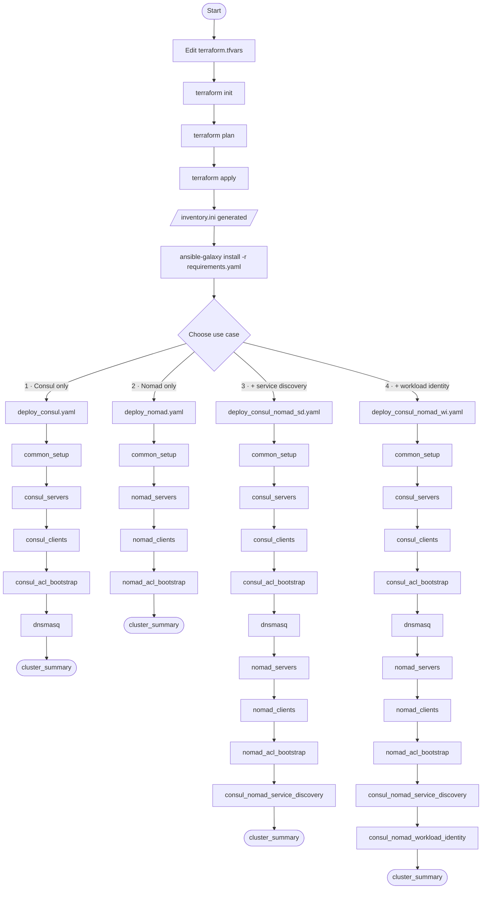

# Nomad plus Consul cluster deployment guide

Step-by-step instructions for deploying a co-located HashiCorp Consul and Nomad cluster on AWS.

## Overview

The deployment has two phases:

1. **Terraform** — Provisions AWS infrastructure (~five minutes)
2. **Ansible** — Installs and configures Consul and Nomad (~10–15 minutes)



## Prerequisites

| Tool | Minimum version | Verify |
|------|----------------|--------|
| Terraform | 1.0 | `terraform version` |
| Ansible | 2.14 | `ansible --version` |
| AWS CLI | any | `aws sts get-caller-identity` |

Install Ansible Galaxy roles before running any playbook:

```bash
cd ansible
ansible-galaxy install -r requirements.yaml
```

## AWS credentials

```bash
# Option 1: AWS CLI
aws configure

# Option 2: Environment variables
export AWS_ACCESS_KEY_ID="..."
export AWS_SECRET_ACCESS_KEY="..."
export AWS_DEFAULT_REGION="us-east-2"

# Option 3: Named profile
export AWS_PROFILE="your-profile-name"

# Verify
aws sts get-caller-identity
```

---

## Phase 1: Provision infrastructure (Terraform)

### Step 1: Configure variables

```bash
cd terraform/aws
cp terraform.tfvars.example terraform.tfvars
```

Edit `terraform.tfvars`:

```hcl
aws_region           = "us-east-2"
project_name         = "nomad-consul"
owner                = "your-name"
environment          = "dev"

vpc_cidr             = "10.0.0.0/16"
subnet_cidr          = "10.0.1.0/24"

# IMPORTANT: restrict to your IP
allowed_ssh_cidr     = "<your-ip>/32"

server_count         = 3   # Use odd numbers: 3, 5, or 7
client_count         = 2
server_instance_type = "t3.medium"
client_instance_type = "t3.medium"
```

### Step 2: Initialize Terraform

```bash
terraform init
```

Downloads the AWS, Local, Null, and TLS providers.

### Step 3: Review the execution plan

```bash
terraform plan
```

Expect Terraform to create ~18 resources. Review instance types, counts, and security group rules before proceeding.

### Step 4: Apply

```bash
terraform apply
```

Type `yes` when prompted. Duration: ~five minutes.

**What Terraform creates:**

| Resource | Details |
|----------|---------|
| VPC | `10.0.0.0/16`, DNS enabled |
| Public subnet | `10.0.1.0/24`, auto-assign public IPs |
| Internet gateway | Attached to VPC |
| Route table | Default route `0.0.0.0/0` → internet gateway |
| Security group | Ports 22, 8500, 4646, all-internal |
| Server EC2 instances (×3) | Ubuntu 24.04, t3.medium, 50 GB gp3, tagged `AutoJoinRole=server` |
| Client EC2 instances (×2) | Ubuntu 24.04, t3.medium, 50 GB gp3, tagged `AutoJoinRole=client` |
| IAM instance profile | `ec2:DescribeInstances` for Cloud Auto-Join |
| SSH key pair | Written to `ansible/ssh_key.pem` (mode 0600) |
| Ansible inventory | Written to `ansible/inventory.ini` |

### Step 5: Review Terraform outputs

```bash
terraform output
terraform output nomad_ui_urls
terraform output ssh_commands
```

### Step 6: Verify SSH connectivity

```bash
cd ../../ansible
ansible all -m ping
```

Expected: `pong` from all 5 hosts. If connections fail:

```bash
chmod 600 ssh_key.pem
ansible all -m ping -vvv
```

---

## Phase 2: Cluster configuration (Ansible)

Run all commands from the `ansible/` directory with `-i inventory.ini`.

```bash
cd ansible
```

Four use case entrypoints cover the most common deployment scenarios. Each one runs `common_setup` first (configures all hosts, tests Ansible connectivity), then executes the required sub-playbooks in order, and finishes with a `cluster_summary` that prints tokens and ready-to-paste `export` commands.

Choose the option that matches your requirements.

---

### Option A: Consul cluster only — `deploy_consul.yaml`

Deploys Consul servers and clients, bootstraps Consul ACL, and configures dnsmasq for `.consul` DNS forwarding on all nodes. Use this when you need only Consul for service discovery or service mesh without Nomad.

```bash
ansible-playbook -i inventory.ini deploy_consul.yaml
```

Sub-playbooks executed in order:

| Step | Sub-playbook | Hosts | What it does |
|------|-------------|-------|--------------|
| 1 | `common_setup` | `all` | Configures passwordless sudo; tests Ansible connectivity (ping) |
| 2 | `consul_servers` | `[servers]` | Installs Consul 2.0.1 in server mode; enables Cloud Auto-Join via `AutoJoinRole=server` EC2 tag; writes `/etc/consul.d/consul.hcl`; starts service; waits for port 8500 |
| 3 | `consul_clients` | `[clients]` | Installs Consul 2.0.1 in client mode; joins server cluster via Cloud Auto-Join |
| 4 | `consul_acl_bootstrap` | `servers[0]` | Bootstraps Consul ACL; saves management token to `ansible/tokens/consul-bootstrap-*.txt` |
| 5 | `dnsmasq` | `all` | Installs dnsmasq; disables systemd-resolved stub listener; forwards `.consul` queries to `127.0.0.1:8600`; rewrites `/etc/resolv.conf` |
| 6 | `cluster_summary` | `localhost` | Prints Consul bootstrap token, `export CONSUL_HTTP_ADDR` and `export CONSUL_HTTP_TOKEN` commands, and Consul UI URL |

Duration: ~10 minutes.

---

### Option B: Nomad cluster only — `deploy_nomad.yaml`

Deploys Nomad servers and clients and bootstraps Nomad ACL. No Consul integration. Use this when you need only Nomad for workload orchestration.

```bash
ansible-playbook -i inventory.ini deploy_nomad.yaml
```

Sub-playbooks executed in order:

| Step | Sub-playbook | Hosts | What it does |
|------|-------------|-------|--------------|
| 1 | `common_setup` | `all` | Configures passwordless sudo; tests Ansible connectivity (ping) |
| 2 | `nomad_servers` | `[servers]` | Installs Nomad 2.0.3 in server mode; uses static `server_join.retry_join` with private IPs from the `[servers]` group; writes `/etc/nomad.d/nomad.hcl`; starts service; waits for port 4646 |
| 3 | `nomad_clients` | `[clients]` | Installs Nomad 2.0.3 in client mode; installs CNI plugins (Ubuntu) and Docker CE; uses static `server_join.retry_join` |
| 4 | `nomad_acl_bootstrap` | `servers[0]` | Bootstraps Nomad ACL; saves management token to `ansible/tokens/nomad-bootstrap-*.txt` |
| 5 | `cluster_summary` | `localhost` | Prints Nomad bootstrap token, `export NOMAD_ADDR` and `export NOMAD_TOKEN` commands, and Nomad UI URL |

Duration: ~10 minutes.

---

### Option C: Consul + Nomad with service discovery — `deploy_consul_nomad_sd.yaml`

Deploys a full Consul cluster and a full Nomad cluster, then creates Consul ACL policies and scoped agent tokens for Nomad server and client agents. Reconfigures all Nomad agents with a `consul { address token }` block so Nomad uses Consul for service registration and health checks.

```bash
ansible-playbook -i inventory.ini deploy_consul_nomad_sd.yaml
```

Sub-playbooks executed in order:

| Step | Sub-playbook | Hosts | What it does |
|------|-------------|-------|--------------|
| 1 | `common_setup` | `all` | Configures passwordless sudo; tests Ansible connectivity (ping) |
| 2 | `consul_servers` | `[servers]` | Installs Consul 2.0.1 in server mode; enables Cloud Auto-Join |
| 3 | `consul_clients` | `[clients]` | Installs Consul 2.0.1 in client mode; joins server cluster |
| 4 | `consul_acl_bootstrap` | `servers[0]` | Bootstraps Consul ACL; saves management token to `ansible/tokens/` |
| 5 | `dnsmasq` | `all` | Installs dnsmasq; configures `.consul` DNS forwarding to port 8600 |
| 6 | `nomad_servers` | `[servers]` | Installs Nomad 2.0.3 in server mode; static `server_join.retry_join` |
| 7 | `nomad_clients` | `[clients]` | Installs Nomad 2.0.3 in client mode; installs CNI plugins and Docker CE |
| 8 | `nomad_acl_bootstrap` | `servers[0]` | Bootstraps Nomad ACL; saves management token to `ansible/tokens/` |
| 9 | `consul_nomad_service_discovery` | `servers[0]` + `all` | Creates Consul ACL policies `nomad-server-policy` and `nomad-client-policy`; creates scoped agent tokens for Nomad servers and clients; saves token SecretIDs to `ansible/tokens/nomad-consul-*-secret-id.txt`; reconfigures Nomad servers and clients with `consul { address token }` block; restarts Nomad on all nodes |
| 10 | `cluster_summary` | `localhost` | Prints all tokens, all `export` commands, and both UI URLs |

**Status summary includes:** Consul bootstrap token, Nomad bootstrap token, Consul agent token for Nomad servers, Consul agent token for Nomad clients, `export CONSUL_HTTP_ADDR`, `export CONSUL_HTTP_TOKEN`, `export NOMAD_ADDR`, `export NOMAD_TOKEN`, and both UI URLs.

Duration: ~15 minutes.

To add workload identity to this deployment later:

```bash
ansible-playbook -i inventory.ini playbooks/consul_nomad_workload_identity.yaml
```

---

### Option D: Consul + Nomad with service discovery and workload identity — `deploy_consul_nomad_wi.yaml`

Extends Option C by configuring a Consul JWT auth method that validates Nomad workload JWTs, and adding `service_identity` and `task_identity` blocks to the Nomad server configuration. Nomad services and tasks automatically exchange a short-lived JWT for a scoped Consul ACL token at runtime. No static secrets are required in job files.

```bash
ansible-playbook -i inventory.ini deploy_consul_nomad_wi.yaml
```

Sub-playbooks executed in order:

| Step | Sub-playbook | Hosts | What it does |
|------|-------------|-------|--------------|
| 1–9 | Same as Option C | — | Refer to Option C table |
| 10 | `consul_nomad_workload_identity` | `servers[0]` + `[servers]` | Creates Consul ACL policy `nomad-tasks-policy`; creates JWT auth method `nomad-workloads` (JWKS URL points to first Nomad server port 4646); creates binding rule mapping `nomad_service` JWT claims to Consul service identities; creates role `nomad-tasks-default`; creates binding rule mapping task workload JWTs to `nomad-tasks-default`; reconfigures Nomad servers with `service_identity` and `task_identity` blocks in the `consul {}` stanza; restarts Nomad servers |
| 11 | `cluster_summary` | `localhost` | Prints all tokens, all `export` commands, and both UI URLs |

**Status summary includes:** same as Option C.

Duration: ~15 minutes.

Verify the JWT auth method after deployment:

```bash
consul acl auth-method list
# Expected output includes: nomad-workloads
```

---

### Post-deployment: set environment variables

After any deployment, source the helper script to export all environment variables automatically:

```bash
cd ansible
source ./set-cluster-env.sh
```

The script reads the first server IP from `inventory.ini` and token values from `ansible/tokens/`. It only exports variables whose token files exist, so it works correctly for all four options.

---

### Advanced: run individual layers

You can run individual sub-playbooks directly for targeted operations, such as re-deploying only the Consul servers or re-running ACL bootstrap after a reset.

#### Consul layer

```bash
ansible-playbook -i inventory.ini playbooks/consul_servers.yaml
ansible-playbook -i inventory.ini playbooks/consul_clients.yaml
ansible-playbook -i inventory.ini playbooks/consul_acl_bootstrap.yaml
ansible-playbook -i inventory.ini playbooks/dnsmasq.yaml
```

Roles applied by `consul_servers` (in order):

| Role | Purpose |
|------|---------|
| `common` | Sets hostname, installs base packages |
| `geerlingguy.docker` | Installs Docker CE; adds `ubuntu` user to the docker group |
| `helper` | Installs apt packages: jq, net-tools, unzip, nano, curl |
| `consul` | Installs Consul 2.0.1; writes `/etc/consul.d/consul.hcl`; creates systemd unit; starts service |

Key configuration values applied by `consul_servers`:

| Setting | Value |
|---------|-------|
| Mode | Server |
| `bootstrap_expect` | `{{ groups['servers'] \| length }}` |
| Datacenter | `dc1` |
| Cloud Auto-Join tag | `AutoJoinRole=server` |
| ACLs | Enabled |
| TLS | Disabled (set `consul_tls_enabled: true` to enable) |

Post-task: waits for Consul HTTP API on `127.0.0.1:8500`, then prints the UI URL.

Roles applied by `consul_clients` (in order):

| Role | Purpose |
|------|---------|
| `common` | Sets hostname, installs base packages |
| `geerlingguy.docker` | Installs Docker CE; adds `ubuntu` user to the docker group |
| `helper` | Installs apt packages: jq, net-tools, unzip, nano, curl |
| `consul` | Installs Consul 2.0.1 in client mode; Cloud Auto-Join finds servers via `AutoJoinRole=server` tag |

Key configuration values applied by `consul_clients`:

| Setting | Value |
|---------|-------|
| Mode | Client |
| Cloud Auto-Join tag | `AutoJoinRole=server` |
| ACLs | Disabled on clients by default |
| TLS | Disabled |

#### Nomad layer

```bash
ansible-playbook -i inventory.ini playbooks/nomad_servers.yaml
ansible-playbook -i inventory.ini playbooks/nomad_clients.yaml
ansible-playbook -i inventory.ini playbooks/nomad_acl_bootstrap.yaml
```

Roles applied by `nomad_servers` (in order):

| Role | Purpose |
|------|---------|
| `common` | Sets hostname, installs base packages |
| `tls` | Generates self-signed TLS certificates on the control machine (only when `nomad_tls_enabled: true`) |
| `helper` | Installs build-essential, git, jq, net-tools, unzip, nano; copies TLS certs to `/etc/nomad.d/.tls/` when TLS is enabled |
| `nomad` | Installs Nomad 2.0.3; writes `/etc/nomad.d/nomad.hcl`; creates systemd unit; starts service |

Key configuration values applied by `nomad_servers`:

| Setting | Value |
|---------|-------|
| Mode | Server |
| `bootstrap_expect` | `{{ groups['servers'] \| length }}` |
| `server_join.retry_join` | Static list of server private IPs from `[servers]` inventory group |
| Cloud Auto-Join | Disabled (static join used instead) |
| ACLs | Enabled |
| TLS | Disabled (set `nomad_tls_enabled: true` to enable) |
| Log level | DEBUG |

Post-task: waits for Nomad HTTP API on port 4646.

Roles applied by `nomad_clients` (in order):

| Role | Purpose |
|------|---------|
| `cni` | Installs CNI plugins (Ubuntu only) |
| `geerlingguy.docker` | Installs Docker CE |
| `tls` | Generates TLS certs (only when `nomad_tls_enabled: true`) |
| `helper` | Installs packages; loads `bridge` kernel module; copies TLS certs |
| `nomad` | Installs Nomad 2.0.3 in client mode |

Key configuration values applied by `nomad_clients`:

| Setting | Value |
|---------|-------|
| Mode | Client |
| `server_join.retry_join` | Static list of server private IPs from `[servers]` inventory group |
| Cloud Auto-Join | Disabled |
| ACLs | Enabled |
| TLS | Disabled |
| Log level | DEBUG |

Post-task: waits for Nomad HTTP API on port 4646.

---

## Phase 3: ACL bootstrap (for individual layer deployments)

> **Note:** ACL bootstrap is included automatically in all four use case entrypoints (`deploy_consul.yaml`, `deploy_nomad.yaml`, `deploy_consul_nomad_sd.yaml`, `deploy_consul_nomad_wi.yaml`). Only run these playbooks separately if you deployed Consul or Nomad using individual layer playbooks from the [Advanced section](#advanced-run-individual-layers).

The bootstrap must be run **once**, after the cluster is first formed.

### Consul ACL bootstrap

```bash
ansible-playbook -i inventory.ini playbooks/consul_acl_bootstrap.yaml
```

Targets `servers[0]` (first server only). Calls `consul acl bootstrap`, saves the management token locally (mode 0600), and exits cleanly on re-runs.

**Output files** (on the Ansible control machine):

| File | Contents |
|------|----------|
| `ansible/tokens/consul-bootstrap-token-output.txt` | Full bootstrap output + usage notes |
| `ansible/tokens/consul-bootstrap-secret-id.txt` | SecretID only, for scripting |

**Use the token:**

```bash
export CONSUL_HTTP_TOKEN=$(cat ansible/tokens/consul-bootstrap-secret-id.txt)
consul members
consul acl token read -self
```

### Nomad ACL bootstrap

```bash
ansible-playbook -i inventory.ini playbooks/nomad_acl_bootstrap.yaml
```

Targets `servers[0]`. Calls `nomad acl bootstrap`, saves the management token locally (mode 0600), and exits cleanly on re-runs.

**Output files** (on the Ansible control machine):

| File | Contents |
|------|----------|
| `ansible/tokens/nomad-bootstrap-token-output.txt` | Full bootstrap output + usage notes |
| `ansible/tokens/nomad-bootstrap-secret-id.txt` | SecretID only, for scripting |

**Use the token:**

```bash
export NOMAD_TOKEN=$(cat ansible/tokens/nomad-bootstrap-secret-id.txt)
nomad server members
nomad acl token self
```

---

## Post-deployment verification

SSH to a server to run the verification commands:

```bash
ssh -i ansible/ssh_key.pem ubuntu@<server-public-ip>
```

### Verify Consul

```bash
# Should show 3 servers + 2 clients
consul members

# Expected output:
# Node                        Address          Status  Type    Build   Protocol  DC   Partition  Segment
# nomad-consul-server-1  10.0.1.x:8301   alive   server  2.0.1   2         dc1  default    <all>
# nomad-consul-server-2  10.0.1.y:8301   alive   server  2.0.1   2         dc1  default    <all>
# nomad-consul-server-3  10.0.1.z:8301   alive   server  2.0.1   2         dc1  default    <all>
# nomad-consul-client-1  10.0.1.a:8301   alive   client  2.0.1   2         dc1  default    <default>
# nomad-consul-client-2  10.0.1.b:8301   alive   client  2.0.1   2         dc1  default    <default>

consul info | grep -E "server|leader|peers"
```

### Verify Nomad

```bash
# Check server quorum (one node should be Leader)
nomad server members

# Expected output:
# Name                           Address     Port  Status  Leader  Raft Version  Build  DC   Region
# nomad-consul-server-1.dc1  10.0.1.x    4648  alive   false   3             2.0.0  dc1  global
# nomad-consul-server-2.dc1  10.0.1.y    4648  alive   true    3             2.0.0  dc1  global
# nomad-consul-server-3.dc1  10.0.1.z    4648  alive   false   3             2.0.0  dc1  global

# Check registered client nodes
nomad node status
```

### Access the UIs

| Service | URL |
|---------|-----|
| Consul UI | `http://<server-public-ip>:8500/ui` |
| Nomad UI | `http://<server-public-ip>:4646` |

### Run a test Nomad job

```bash
cat > example.nomad << 'EOF'
job "example" {
  datacenters = ["dc1"]
  type        = "service"

  group "web" {
    count = 2

    task "nginx" {
      driver = "docker"

      config {
        image = "nginx:latest"
        ports = ["http"]
      }

      resources {
        cpu    = 100
        memory = 128
      }
    }

    network {
      port "http" { to = 80 }
    }
  }
}
EOF

nomad job run example.nomad
nomad job status example
```

---

## Troubleshooting

### SSH connection failures

```bash
# Fix key permissions
chmod 600 ansible/ssh_key.pem

# Test manually
ssh -i ansible/ssh_key.pem ubuntu@<server-ip>

# Run Ansible with verbose output
ansible all -m ping -vvv -i ansible/inventory.ini
```

### Consul not forming a quorum

```bash
# View Consul logs on a server
sudo journalctl -u consul -n 100

# Verify the AutoJoinRole tag exists on instances
aws ec2 describe-instances \
  --filters "Name=tag:AutoJoinRole,Values=server" \
  --query 'Reservations[*].Instances[*].[InstanceId,State.Name,Tags]' \
  --output table

# Verify the IAM instance profile is attached
aws ec2 describe-instances \
  --filters "Name=tag:AutoJoinRole,Values=server" \
  --query 'Reservations[*].Instances[*].[InstanceId,IamInstanceProfile.Arn]' \
  --output table
```

### Nomad servers not forming a quorum

```bash
# View Nomad logs on a server
sudo journalctl -u nomad -n 100

# Confirm retry_join addresses are reachable from one server to another
ping <other-server-private-ip>
```

### Nomad clients not connecting to servers

```bash
# View Nomad client logs
sudo journalctl -u nomad -n 100

# Verify security group allows all internal traffic (protocol -1, self)
# This is set by network.tf and should already be correct
```

### Service not starting after config change

```bash
sudo systemctl status consul
sudo systemctl status nomad

# Follow logs in real time
sudo journalctl -u consul -f
sudo journalctl -u nomad -f
```

### Terraform: duplicate key pair error

```bash
aws ec2 delete-key-pair --key-name nomad-consul-key
# Then re-run terraform apply
```

### Terraform: InsufficientInstanceCapacity

Try a different availability zone or instance type (for example, `t3a.medium`), or wait a few minutes and retry.

---

## Cleanup

From the `ansible` directory, run the teardown playbook. After removing software
and reversing configuration on the VMs, this playbook removes tokens and TLS
certificates from your workstation.

```bash
ansible-playbook -i inventory.ini teardown.yaml
```

Then destroy all EC2 instances, VPC, IAM roles, and SSH key pairs.

```bash
cd ../terraform/aws
terraform destroy
```
