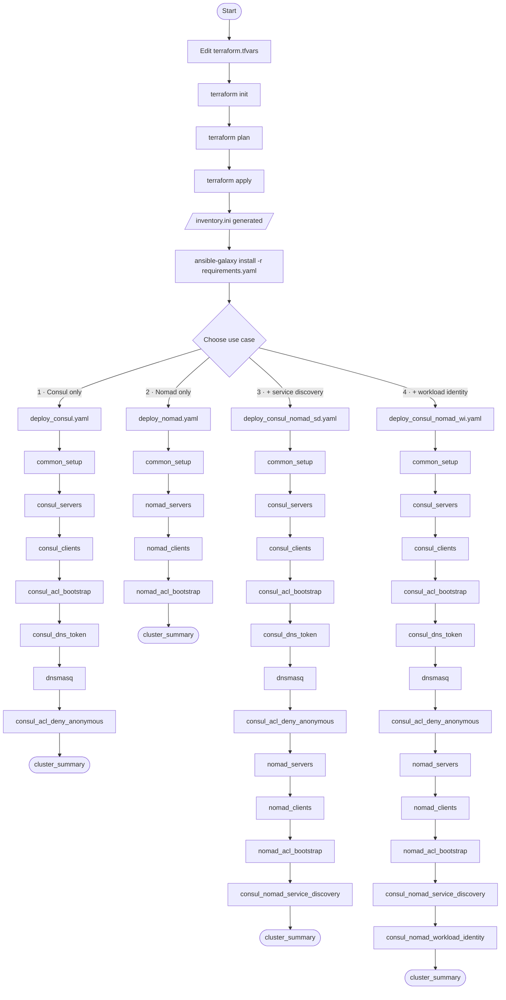

# Nomad plus Consul cluster deployment guide

This guide provides step-by-step instructions for deploying a co-located HashiCorp Consul and Nomad cluster on AWS.

## Overview

The deployment has two phases:

1. **Terraform** — Provisions AWS infrastructure (approximately five minutes)
2. **Ansible** — Installs and configures Consul and Nomad (approximately 10–15 minutes)



## Deployment workflows

Each of the following use cases is a complete end-to-end checklist. Steps 1–4 are identical
for all use cases. Follow only the checklist for your use case — each step links
to the detailed section in this guide.

### Use case A: Consul cluster only

1. **[Install prerequisites](#prerequisites)**
1. **[Configure AWS credentials](#aws-credentials)**
1. **[Provision infrastructure](#phase-1-provision-infrastructure-terraform)**
1. **[Install Ansible Galaxy roles](#phase-2-cluster-configuration-ansible)**
1. **[Deploy the Consul cluster](#option-a-consul-cluster-only----deploy_consulyaml)**
1. **[Export environment variables](#post-deployment-set-environment-variables)**
1. **[Verify the cluster](#verify-consul)**
1. **[Clean up when done](#cleanup)**

---

### Use case B: Nomad cluster only

1. **[Install prerequisites](#prerequisites)**
2. **[Configure AWS credentials](#aws-credentials)**
3. **[Provision infrastructure](#phase-1-provision-infrastructure-terraform)**
4. **[Install Ansible Galaxy roles](#phase-2-cluster-configuration-ansible)**
5. **[Deploy the Nomad cluster](#option-b-nomad-cluster-only----deploy_nomadyaml)**
6. **[Export environment variables](#post-deployment-set-environment-variables)**
7. **[Verify the cluster](#verify-nomad)**
8. **[Clean up when done](#cleanup)**
---

### Use case C: Consul + Nomad with service discovery

1. **[Install prerequisites](#prerequisites)**
2. **[Configure AWS credentials](#aws-credentials)**
3. **[Provision infrastructure](#phase-1-provision-infrastructure-terraform)**
4. **[Install Ansible Galaxy roles](#phase-2-cluster-configuration-ansible)**
5. **[Deploy the cluster](#option-c-consul--nomad-with-service-discovery----deploy_consul_nomad_sdyaml)**
6. **[Export environment variables](#post-deployment-set-environment-variables)**
7. **[Verify the cluster](#post-deployment-verification)**
8. **[Clean up when done](#cleanup)**

---

### Use case D: Consul + Nomad with service discovery and workload identity

1. **[Install prerequisites](#prerequisites)**
2. **[Configure AWS credentials](#aws-credentials)**
3. **[Provision infrastructure](#phase-1-provision-infrastructure-terraform)**
4. **[Install Ansible Galaxy roles](#phase-2-cluster-configuration-ansible)**
5. **[Deploy the cluster](#option-d-consul--nomad-with-service-discovery-and-workload-identity----deploy_consul_nomad_wiyaml)**
6. **[Export environment variables](#post-deployment-set-environment-variables)**
7. **[Verify the cluster](#post-deployment-verification)**
8. **[Clean up when done](#cleanup)**

---

## Prerequisites

| Tool | Minimum version | Verify |
|------|----------------|--------|
| Terraform | 1.0 | `terraform version` |
| Ansible | 2.14 | `ansible --version` |
| AWS CLI | any | `aws sts get-caller-identity` |

Ansible requires the locale encoding on the control machine (where you run `ansible-playbook`) to be UTF-8. Any locale works — `it_IT.UTF-8`, `fr_FR.UTF-8`, `en_US.UTF-8`, and so on — as long as the `.UTF-8` charset suffix is present. The playbooks themselves are locale-agnostic.

Verify your locale before running any playbook:

```bash
locale
```

If `LANG` or `LC_ALL` is missing the `.UTF-8` suffix (for example, `it_IT` instead of `it_IT.UTF-8`), append it:

```bash
export LANG="${LANG}.UTF-8"   # for example: it_IT  →  it_IT.UTF-8
export LC_ALL="${LANG}"
```

Or set an explicit value if `LANG` is unset.

```bash
export LANG=it_IT.UTF-8
export LC_ALL=it_IT.UTF-8
```

Install Ansible Galaxy roles before running any playbook:

```bash
cd ansible
ansible-galaxy install -r requirements.yaml
```

## AWS credentials

```bash
# Option 1: AWS CLI
aws configure

# Option 2: Environment variables
export AWS_ACCESS_KEY_ID="..."
export AWS_SECRET_ACCESS_KEY="..."
export AWS_DEFAULT_REGION="us-east-2"

# Option 3: Named profile
export AWS_PROFILE="your-profile-name"

# Verify
aws sts get-caller-identity
```

---

## Configuration reference

### Terraform variables

| Variable | Default | Description |
|----------|---------|-------------|
| `aws_region` | `us-east-2` | AWS region |
| `project_name` | `nomad-consul` | Resource name prefix |
| `owner` | `devops-team` | Owner tag |
| `environment` | `dev` | Environment tag |
| `vpc_cidr` | `10.0.0.0/16` | VPC CIDR block |
| `subnet_cidr` | `10.0.1.0/24` | Public subnet CIDR |
| `allowed_ssh_cidr` | `0.0.0.0/0` | CIDR allowed for SSH |
| `server_count` | `3` | Number of server EC2 instances |
| `client_count` | `2` | Number of client EC2 instances |
| `server_instance_type` | `t3.medium` | Server EC2 instance type |
| `client_instance_type` | `t3.medium` | Client EC2 instance type |

Always set `allowed_ssh_cidr` to your specific IP address or network range.

### Ansible variables — Consul

Defaults: [`ansible/roles/consul/defaults/main.yaml`](ansible/roles/consul/defaults/main.yaml)

| Variable | Default | Description |
|----------|---------|-------------|
| `consul_binary_version` | `2.0.1` | Consul release to install |
| `consul_datacenter` | `dc1` | Datacenter name |
| `consul_server_enabled` | `false` | Enable server mode |
| `consul_server_bootstrap_expect` | `3` | Quorum size |
| `consul_cloud_auto_join_enabled` | `false` | Enable AWS Cloud Auto-Join |
| `consul_acl_enabled` | `false` | Enable ACLs |
| `consul_tls_enabled` | `false` | Enable TLS |

### Ansible variables — Nomad

Defaults: [`ansible/roles/nomad/defaults/main.yaml`](ansible/roles/nomad/defaults/main.yaml)

| Variable | Default | Description |
|----------|---------|-------------|
| `nomad_binary_version` | `2.0.4` | Nomad release to install |
| `nomad_server_enabled` | `false` | Enable server mode |
| `nomad_server_bootstrap_expect` | `3` | Quorum size |
| `nomad_client_enabled` | `false` | Enable client mode |
| `nomad_cloud_auto_join_enabled` | `false` | Enable AWS Cloud Auto-Join |
| `nomad_acl_enabled` | `false` | Enable ACLs |
| `nomad_tls_enabled` | `false` | Enable TLS |
| `nomad_log_level` | `DEBUG` | Log level |

---

## Network security

The security group allows:

- **SSH (22)**: From `allowed_ssh_cidr`. The default value `0.0.0.0/0` is not appropriate for production. Set this to your specific IP address or network range.
- **Consul HTTP API/UI (8500)**: From `0.0.0.0/0`. Restrict this in production.
- **Nomad HTTP API/UI (4646)**: From `0.0.0.0/0`. Restrict this in production.
- **All internal traffic**: Between instances sharing the security group
- **Egress**: All outbound traffic allowed

Refer to [ansible/README-SECURITY-GROUP.md](ansible/README-SECURITY-GROUP.md) for hardening guidance.

### Default open ports

| Port | Protocol | Service | Accessible from |
|------|----------|---------|----------------|
| 22 | TCP | SSH | `allowed_ssh_cidr` |
| 8500 | TCP | Consul HTTP API & UI | `0.0.0.0/0` |
| 8300 | TCP | Consul RPC | Internal (security group) |
| 8301 | TCP/UDP | Consul Serf LAN | Internal (security group) |
| 4646 | TCP | Nomad HTTP API & UI | `0.0.0.0/0` |
| all | all | Internal cluster traffic | Internal (security group) |

### IAM permissions

Every EC2 instance receives an IAM instance profile with the following permissions for Consul Cloud Auto-Join:

- `ec2:DescribeInstances`
- `ec2:DescribeTags`
- `autoscaling:DescribeAutoScalingGroups`

---

## Phase 1: Provision infrastructure (Terraform)

### Step 1: Configure variables

```bash
cd terraform/aws
cp terraform.tfvars.example terraform.tfvars
```

Edit `terraform.tfvars` to use values specific to your deployment. This guide
was tested with an Ubuntu 24.04 AMI.

**Important values:**

- `aws_region`
- `owner`
- `allowed_ssh_cidr`
- `ami_owner`
- `ami_name_filter`


```hcl
aws_region           = "<aws-region>"
project_name         = "nomad-consul"
owner                = "<your-name>"
environment          = "dev"

# Network configuration
vpc_cidr             = "10.0.0.0/16"
subnet_cidr          = "10.0.1.0/24"
# IMPORTANT: restrict to your IP
allowed_ssh_cidr     = "<your-ip>/32"

# AMI configuration
ami_owner     = "099720109477" # Canonical
ami_name_filter     = "ubuntu/images/hvm-ssd-gp3/ubuntu-noble-24.04-amd64-server-*"
ami_architecture     = "x86_64"

# Instance configuration
server_count         = 3   # Use odd numbers: 3, 5, or 7
client_count         = 2
server_instance_type = "t3.micro"
client_instance_type = "t3.medium"
```

### Step 2: Initialize Terraform

```bash
terraform init
```

This command downloads the AWS, Local, Null, and TLS providers.

### Step 3: Review the execution plan

```bash
terraform plan
```

Terraform creates approximately 18 resources. Review instance types, counts, and security group rules before proceeding.

### Step 4: Apply

```bash
terraform apply
```

Type `yes` when prompted. Terraform takes approximately five minutes to complete.

**What Terraform creates:**

| Resource | Details |
|----------|---------|
| VPC | `10.0.0.0/16`, DNS enabled |
| Public subnet | `10.0.1.0/24`, auto-assign public IPs |
| Internet gateway | Attached to VPC |
| Route table | Default route `0.0.0.0/0` → internet gateway |
| Security group | Static: 22 (SSH), 8500 (Consul), 4646 (Nomad); configurable: `extra_ingress_ports` variable (default: 9002); all-internal |
| Server EC2 instances (×3) | Ubuntu 24.04, t3.medium, 50 GB gp3, tagged `AutoJoinRole=server` |
| Client EC2 instances (×2) | Ubuntu 24.04, t3.medium, 50 GB gp3, tagged `AutoJoinRole=client` |
| IAM instance profile | `ec2:DescribeInstances` for Cloud Auto-Join |
| SSH key pair | Written to `ansible/ssh_key.pem` (mode 0600) |
| Ansible inventory | Written to `ansible/inventory.ini` |

### Step 5: Review Terraform outputs

```bash
terraform output
terraform output nomad_ui_urls
terraform output ssh_commands
```

### Step 6: Verify SSH connectivity

Before you verify connectivity, make sure your AWS VM instances are running.

```bash
cd ../../ansible
ansible all -m ping
```

Expected output is `pong` from all five hosts. If connections fail:

```bash
chmod 600 ssh_key.pem
ansible all -m ping -vvv
```

---

## Phase 2: Cluster configuration (Ansible)

Run all commands from the `ansible/` directory with `-i inventory.ini`.

Four use case entrypoints cover the most common deployment scenarios. Each one
first runs `common_setup`, which tests Ansible connectivity and configures all
hosts. Then the process executes the required sub-playbooks in order and
finishes with a `cluster_summary` that prints tokens and ready-to-paste `export`
commands. The playbooks enable ACLs and create the bootstrap tokens.

Choose the option that matches your requirements.

---

### Option A: Consul cluster only — `deploy_consul.yaml`

Deploys Consul servers and clients, bootstraps Consul ACL, and configures
dnsmasq for `.global` DNS forwarding on all nodes. Use this when you need only
Consul for service discovery or service mesh without Nomad.

Set Consul version and other variables in
[`ansible/group_vars/all.yaml`](ansible/group_vars/all.yaml) before running:

```bash
ansible-playbook -i inventory.ini deploy_consul.yaml
```

Sub-playbooks executed in order:

| Step | Sub-playbook | Hosts | What it does |
|------|-------------|-------|--------------|
| 1 | `common_setup` | `all` | Configures passwordless sudo; tests Ansible connectivity (ping) |
| 2 | `consul_servers` | `[servers]` | Installs Consul 2.0.1 in server mode; enables Cloud Auto-Join using the `AutoJoinRole=server` EC2 tag; writes `/etc/consul.d/consul.hcl`; starts service; waits for port 8500 |
| 3 | `consul_clients` | `[clients]` | Installs Consul 2.0.1 in client mode; joins the server cluster through Cloud Auto-Join |
| 4 | `consul_acl_bootstrap` | `servers[0]` | Bootstraps Consul ACL; saves management token to `ansible/tokens/consul-bootstrap-*.txt` |
| 5 | `consul_dns_token` | `servers[0]` + `[clients]` | Creates `dns-access` ACL policy; creates a shared DNS token and one per-node node-identity agent token per client; applies the DNS token to every Consul agent using `consul acl set-agent-token dns`; re-runs consul role on each client with `consul_acl_enabled: true` to write `acl { tokens { agent dns } }` into `consul.hcl`; saves `ansible/tokens/consul-dns-secret-id.txt` and `ansible/tokens/consul-client-agent-<hostname>-secret-id.txt` |
| 6 | `dnsmasq` | `all` | Installs dnsmasq; disables systemd-resolved stub listener; forwards `.global` queries to `127.0.0.1:8600`; binds to `172.17.0.1` as well so Docker containers can reach dnsmasq; rewrites `/etc/resolv.conf` |
| 7 | `consul_acl_deny_anonymous` | `servers[0]` | Attaches a deny-all policy to the Consul anonymous token; unauthenticated API and DNS requests are rejected after this step |
| 8 | `cluster_summary` | `localhost` | Prints Consul bootstrap token, `export CONSUL_HTTP_ADDR` and `export CONSUL_HTTP_TOKEN` commands, and Consul UI URL |

Duration: approximately 10 minutes.

If the process encounters issues, refer to the [Troubleshooting section](#troubleshooting).

To remove what Ansible deployed, run the `teardown.yaml` playbook. Then run `unset-cluster-env.sh` to remove the environment variables from your terminal.

---

### Option B: Nomad cluster only — `deploy_nomad.yaml`

Deploys Nomad servers and clients and bootstraps Nomad ACL. No Consul integration. Use this when you need only Nomad for workload orchestration.

Set Nomad and CNI plugin versions in
[`ansible/group_vars/all.yaml`](ansible/group_vars/all.yaml) before running:

```bash
ansible-playbook -i inventory.ini deploy_nomad.yaml
```

Sub-playbooks executed in order:

| Step | Sub-playbook | Hosts | What it does |
|------|-------------|-------|--------------|
| 1 | `common_setup` | `all` | Configures passwordless sudo; tests Ansible connectivity (ping) |
| 2 | `nomad_servers` | `[servers]` | Installs Nomad 2.0.4 in server mode; uses static `server_join.retry_join` with private IPs from the `[servers]` group; writes `/etc/nomad.d/nomad.hcl`; starts service; waits for port 4646 |
| 3 | `nomad_clients` | `[clients]` | Installs Nomad 2.0.4 in client mode; installs CNI plugins (Ubuntu) and Docker CE; uses static `server_join.retry_join` |
| 4 | `nomad_acl_bootstrap` | `servers[0]` | Bootstraps Nomad ACL; saves management token to `ansible/tokens/nomad-bootstrap-*.txt` |
| 5 | `cluster_summary` | `localhost` | Prints Nomad bootstrap token, `export NOMAD_ADDR` and `export NOMAD_TOKEN` commands, and Nomad UI URL |

Duration: approximately 10 minutes.

If the process encounters issues, refer to the [Troubleshooting section](#troubleshooting).

To remove what Ansible deployed, run the `teardown.yaml` playbook. Then run `unset-cluster-env.sh` to remove the environment variables from your terminal.

---

### Option C: Consul + Nomad with service discovery — `deploy_consul_nomad_sd.yaml`

Deploys a full Consul cluster and a full Nomad cluster, then creates Consul ACL
policies and scoped agent tokens for Nomad server and client agents.
Reconfigures all Nomad agents with a `consul { address token }` block so Nomad
uses Consul for service registration and health checks.

Set Consul, Nomad, and CNI plugin versions in
[`ansible/group_vars/all.yaml`](ansible/group_vars/all.yaml) before running:

```bash
ansible-playbook -i inventory.ini deploy_consul_nomad_sd.yaml
```

Sub-playbooks executed in order:

| Step | Sub-playbook | Hosts | What it does |
|------|-------------|-------|--------------|
| 1 | `common_setup` | `all` | Configures passwordless sudo; tests Ansible connectivity (ping) |
| 2 | `consul_servers` | `[servers]` | Installs Consul 2.0.1 in server mode; enables Cloud Auto-Join |
| 3 | `consul_clients` | `[clients]` | Installs Consul 2.0.1 in client mode; joins server cluster |
| 4 | `consul_acl_bootstrap` | `servers[0]` | Bootstraps Consul ACL; saves management token to `ansible/tokens/` |
| 5 | `consul_dns_token` | `servers[0]` + `[clients]` | Creates `dns-access` ACL policy; creates DNS token and per-node node-identity agent tokens for each client; applies DNS token to all Consul agents; reconfigures Consul clients with ACL enabled and both tokens in `consul.hcl`; saves `ansible/tokens/consul-dns-secret-id.txt` and `ansible/tokens/consul-client-agent-<hostname>-secret-id.txt` |
| 6 | `dnsmasq` | `all` | Installs dnsmasq; configures `.global` DNS forwarding to port 8600; binds to both `127.0.0.1` and `172.17.0.1` |
| 7 | `consul_acl_deny_anonymous` | `servers[0]` | Attaches deny-all policy to the Consul anonymous token |
| 8 | `nomad_servers` | `[servers]` | Installs Nomad 2.0.4 in server mode; static `server_join.retry_join` |
| 9 | `nomad_clients` | `[clients]` | Installs Nomad 2.0.4 in client mode; installs CNI plugins and Docker CE |
| 10 | `nomad_acl_bootstrap` | `servers[0]` | Bootstraps Nomad ACL; saves management token to `ansible/tokens/` |
| 11 | `consul_nomad_service_discovery` | `servers[0]` + `all` | Creates Consul ACL policies `nomad-server-policy` and `nomad-client-policy`; creates scoped agent tokens for Nomad servers and clients; saves token SecretIDs to `ansible/tokens/nomad-consul-*-secret-id.txt`; reconfigures Nomad servers and clients with `consul { address token }` block; restarts Nomad on all nodes |
| 12 | `cluster_summary` | `localhost` | Prints all tokens, all `export` commands, and both UI URLs |

**Status summary includes:** Consul bootstrap token, Nomad bootstrap token, Consul agent token for Nomad servers, Consul agent token for Nomad clients, `export CONSUL_HTTP_ADDR`, `export CONSUL_HTTP_TOKEN`, `export NOMAD_ADDR`, `export NOMAD_TOKEN`, and both UI URLs.

Duration: approximately 15 minutes.

To add workload identity to this deployment later:

```bash
ansible-playbook -i inventory.ini playbooks/consul_nomad_workload_identity.yaml
```

If the process encounters issues, refer to the [Troubleshooting section](#troubleshooting).

To remove what Ansible deployed, run the `teardown.yaml` playbook. Then run `unset-cluster-env.sh` to remove the environment variables from your terminal.

---

### Option D: Consul + Nomad with service discovery and workload identity — `deploy_consul_nomad_wi.yaml`

Extends Option C by configuring a Consul JWT auth method that validates Nomad workload JWTs, and adding `service_identity` and `task_identity` blocks to the Nomad server configuration. Nomad services and tasks automatically exchange a short-lived JWT for a scoped Consul ACL token at runtime. Job files require no static secrets.

Set Consul, Nomad, and CNI plugin versions in
[`ansible/group_vars/all.yaml`](ansible/group_vars/all.yaml) before running:

```bash
ansible-playbook -i inventory.ini deploy_consul_nomad_wi.yaml
```

Sub-playbooks executed in order:

| Step | Sub-playbook | Hosts | What it does |
|------|-------------|-------|--------------|
| 1–11 | Same as Option C | — | Refer to Option C table |
| 12 | `consul_nomad_workload_identity` | `servers[0]` + `[servers]` | Creates Consul ACL policy `nomad-tasks-policy`; creates JWT auth method `nomad-workloads` (JWKS URL points to first Nomad server port 4646); creates binding rule mapping `nomad_service` JWT claims to Consul service identities; creates role `nomad-tasks-default`; creates binding rule mapping task workload JWTs to `nomad-tasks-default`; reconfigures Nomad servers with `service_identity` and `task_identity` blocks in the `consul {}` stanza; restarts Nomad servers |
| 13 | `cluster_summary` | `localhost` | Prints all tokens, all `export` commands, and both UI URLs |

**Status summary includes:** same as Option C.

Duration: approximately 15 minutes.

Verify the JWT auth method after deployment:

```bash
consul acl auth-method list
# Expected output includes: nomad-workloads
```

If the process encounters issues, refer to the [Troubleshooting section](#troubleshooting).

To remove what Ansible deployed, run the `teardown.yaml` playbook. Then run `unset-cluster-env.sh` to remove the environment variables from your terminal.

---

## Post-deployment: set environment variables

After any deployment, source the helper script to export all environment variables automatically:

```bash
cd ansible
source ./set-cluster-env.sh
```

The script reads the first server IP from `inventory.ini` and token values from
`ansible/tokens/`. It only exports variables whose token files exist, so it
works correctly for all four options.

### Manual export (without the helper script)

```bash
export CONSUL_HTTP_ADDR=http://<server-ip>:8500
export CONSUL_HTTP_TOKEN=$(cat ansible/tokens/consul-bootstrap-secret-id.txt)
export NOMAD_ADDR=http://<server-ip>:4646
export NOMAD_TOKEN=$(cat ansible/tokens/nomad-bootstrap-secret-id.txt)
```

Substitute `<server-ip>` with a server's public IP address from `terraform output` or `inventory.ini`.

---

## Post-deployment verification

After you have set your environment variables, run the verification commands from
your local terminal.

You can also SSH to a server to run the verification commands. If you choose
this option, you must export the environment tokens after you SSH into
the server.

```bash
ssh -o 'IdentitiesOnly=yes' -i ansible/ssh_key.pem ubuntu@<server-public-ip>
```

Then set the environment variables.

```bash
CONSUL_HTTP_TOKEN=<paste-value-from-consul-bootstrap-secret-id.txt>
NOMAD_TOKEN=<paste-value-from-nomad-bootstrap-secret-id.txt>
```

### Verify Consul

```bash
# Should show 3 servers + 2 clients
consul members

# Expected output:
# Node                        Address          Status  Type    Build   Protocol  DC   Partition  Segment
# nomad-consul-server-1  10.0.1.x:8301   alive   server  2.0.1   2         dc1  default    <all>
# nomad-consul-server-2  10.0.1.y:8301   alive   server  2.0.1   2         dc1  default    <all>
# nomad-consul-server-3  10.0.1.z:8301   alive   server  2.0.1   2         dc1  default    <all>
# nomad-consul-client-1  10.0.1.a:8301   alive   client  2.0.1   2         dc1  default    <default>
# nomad-consul-client-2  10.0.1.b:8301   alive   client  2.0.1   2         dc1  default    <default>

consul info | grep -E "server|leader|peers"
```

### Verify Nomad

```bash
# Check server quorum (one node should be Leader)
nomad server members

# Expected output:
# Name                           Address     Port  Status  Leader  Raft Version  Build  DC   Region
# nomad-consul-server-1.dc1  10.0.1.x    4648  alive   false   3             2.0.4  dc1  global
# nomad-consul-server-2.dc1  10.0.1.y    4648  alive   true    3             2.0.4  dc1  global
# nomad-consul-server-3.dc1  10.0.1.z    4648  alive   false   3             2.0.4  dc1  global

# Check registered client nodes
nomad node status
```

### Access the UIs

| Service | URL |
|---------|-----|
| Consul UI | `http://<server-public-ip>:8500/ui` |
| Nomad UI | `http://<server-public-ip>:4646` |

Use the bootstrap token values to log into the UIs. Find the values in these files:

- Consul: `ansible/tokens/consul-bootstrap-secret-id.txt`
- Nomad: `ansible/tokens/nomad-bootstrap-secret-id.txt`

## Deploy a Nomad job

The job specification files for the example Countdash app are located in the
root-level `nomad-jobs` directory. The app has a web UI that connects to an API
on the server. Port 9002 (web UI) is included in the default `extra_ingress_ports`
list in `terraform.tfvars`. To add ports for your own applications, see
[Managing security group ports](#managing-security-group-ports).

### Deploy the app with Nomad for service discovery

This Countdash version uses Nomad for service discovery. For details on service
discovery, refer to the [Configure service discovery
documentation](https://developer.hashicorp.com/nomad/docs/job-declare/service-discovery).

Change to the `nomad-jobs` directory and deploy the job.

```bash
nomad job run countdash-nomad-service-discovery.nomad.hcl
nomad job status countdash
```

Find the Countdash web application's public IP and port.

```bash
nomad service info -json countdash-web
```

The `Address` field contains the public URL, and the `Port` field
contains the port. Access the Countdash web UI at `http://<Address>:<Port>`.

Purge the job with `nomad job stop --purge countdash`.

### Deploy the app with Consul for service discovery

This Countdash version uses Consul for service discovery. Refer to the [Configure
service discovery
documentation](https://developer.hashicorp.com/nomad/docs/job-declare/service-discovery)
for more information.

Change to the `nomad-jobs` directory and deploy the job.

```bash
nomad job run countdash-consul-service-discovery.nomad.hcl
nomad job status countdash
```

Use the Consul API to find the Countdash public address. Before running the following command, complete these steps:

- Set the [post-deployment environment variables](#post-deployment-set-environment-variables)
- [curl v8.3.0 or later](https://curl.se/)
- [jq](https://jqlang.org/)

```bash
curl --variable '%CONSUL_HTTP_ADDR' --variable '%CONSUL_HTTP_TOKEN' --expand-url "{{CONSUL_HTTP_ADDR}}/v1/catalog/service/countdash-web?passing" --expand-header "X-Consul-Token: {{CONSUL_HTTP_TOKEN}}"  | jq -r '.[] | "\(.ServiceAddress):\(.ServicePort)"'
```

The result displays the public URL.

---

## Troubleshooting

### Role not found: geerlingguy.docker

**Symptom:**

```
[ERROR]: The role 'geerlingguy.docker' was not found in: ...
```

The `geerlingguy.docker` role is an external Galaxy role that you must install
before running any playbook because that role is not bundled with this repository.

**Fix:** Run `ansible-galaxy install` from the `ansible/` directory:

```bash
cd ansible
ansible-galaxy install -r requirements.yaml
```

This installs all roles and collections declared in `requirements.yaml`, including `geerlingguy.docker`, into `~/.ansible/roles/` where Ansible can find them. Re-run the failed playbook after the install completes.

### Ansible locale encoding error

**Symptom:** `ERROR: Ansible requires the locale encoding to be UTF-8; Detected ISO8859-1`

Ansible only requires that the locale encoding on the control machine be UTF-8. It does not require a specific language or region. This error appears when the locale is set to a non-UTF-8 charset — for example, `it_IT` (ISO-8859-1) instead of `it_IT.UTF-8`.

**Fix:** Keep your locale; add the `.UTF-8` charset suffix:

```bash
export LANG=it_IT.UTF-8
export LC_ALL=it_IT.UTF-8
```

Substitute your actual locale (`fr_FR`, `de_DE`, `en_GB`, and so on). To make this permanent, add the exports to your shell profile (`~/.bashrc`, `~/.zshrc`, or equivalent).

Verify the result:

```bash
locale
# LANG=it_IT.UTF-8
# LC_ALL=it_IT.UTF-8
```

### SSH connection failures

```bash
# Fix key permissions
chmod 600 ansible/ssh_key.pem

# Test manually
ssh -i ansible/ssh_key.pem ubuntu@<server-ip>

# Run Ansible with verbose output
ansible all -m ping -vvv -i ansible/inventory.ini
```

### Consul not forming a quorum

```bash
# View Consul logs on a server
sudo journalctl -u consul -n 100

# Verify the AutoJoinRole tag exists on instances
aws ec2 describe-instances \
  --filters "Name=tag:AutoJoinRole,Values=server" \
  --query 'Reservations[*].Instances[*].[InstanceId,State.Name,Tags]' \
  --output table

# Verify the IAM instance profile is attached
aws ec2 describe-instances \
  --filters "Name=tag:AutoJoinRole,Values=server" \
  --query 'Reservations[*].Instances[*].[InstanceId,IamInstanceProfile.Arn]' \
  --output table
```

### Nomad servers not forming a quorum

```bash
# View Nomad logs on a server
sudo journalctl -u nomad -n 100

# Confirm retry_join addresses are reachable from one server to another
ping <other-server-private-ip>
```

### Nomad clients not connecting to servers

```bash
# View Nomad client logs
sudo journalctl -u nomad -n 100

# Verify security group allows all internal traffic (protocol -1, self)
# This is set by network.tf and should already be correct
```

### Service not starting after config change

```bash
sudo systemctl status consul
sudo systemctl status nomad

# Follow logs in real time
sudo journalctl -u consul -f
sudo journalctl -u nomad -f
```

### Inspect the rendered configuration files

All configuration templates write their output to the remote host before the
service starts. Use the `debug_config` tag to read those files back to your
terminal and confirm the rendered values match your expectations.

```bash
# Print rendered configs for all roles in a full deployment run
ansible-playbook -i inventory.ini ansible/deploy_consul_nomad_sd.yaml --tags debug_config -v

# Inspect individual layers
ansible-playbook -i inventory.ini ansible/playbooks/nomad_servers.yaml --tags debug_config -v
ansible-playbook -i inventory.ini ansible/playbooks/nomad_clients.yaml --tags debug_config -v
ansible-playbook -i inventory.ini ansible/playbooks/consul_servers.yaml --tags debug_config -v
ansible-playbook -i inventory.ini ansible/playbooks/consul_clients.yaml --tags debug_config -v
```

The `-v` flag activates the debug output. Without it, the slurp tasks still run
but output is suppressed. The `consul.hcl` print task is automatically
suppressed when gossip encryption is enabled to avoid leaking the gossip key.

### Consul DNS returns SERVFAIL — stale token file from a previous cluster

After deploying a new cluster, `.global` DNS queries return SERVFAIL even
though `consul.hcl` on the clients shows an `acl.tokens.dns` value. Running
`consul acl token list` shows no `dns-access` policy and the UUID in the
config does not match any token in the ACL system.

**Cause:** `ansible/tokens/consul-dns-secret-id.txt` is a leftover from a
previous cluster. The `consul_dns_token.yaml` idempotency sentinel sees the
file and skips token creation, so the old UUID is written into the new
`consul.hcl` — pointing at a token that was never created for this cluster.

**Fix:** Delete the stale sentinel file and re-run the playbook.

```bash
cd ansible
rm tokens/consul-dns-secret-id.txt
ansible-playbook -i inventory.ini playbooks/consul_dns_token.yaml
```

After it completes, restart the Nomad job:

```bash
nomad job stop countdash
nomad job run nomad-jobs/countdash-consul-service-discovery.nomad.hcl
```

**Prevention:** Always run `teardown.yaml` before destroying infrastructure.
If you skip teardown and run `terraform destroy` directly, manually delete all
files under `ansible/tokens/` before the next deployment:

```bash
rm ansible/tokens/*.txt
```

### Terraform: duplicate key pair error

```bash
aws ec2 delete-key-pair --key-name nomad-consul-key
# Then re-run terraform apply
```

### Terraform: InsufficientInstanceCapacity

Try a different availability zone or instance type (for example, `t3a.medium`). Alternatively, wait a few minutes and retry.

---

## Managing security group ports

Two approaches are available for adding ingress ports to the cluster's security group. See [ansible/README-SECURITY-GROUP.md](ansible/README-SECURITY-GROUP.md) for full details on both approaches.

### Terraform (persistent — survives terraform apply)

Edit `extra_ingress_ports` in `terraform/aws/terraform.tfvars`:

```hcl
extra_ingress_ports = [
  { port = 9002, description = "Countdash example app - web UI" },
  { port = 8080, description = "My application" },
]
```

```bash
cd terraform/aws
terraform plan
terraform apply
```

To close a port, remove its entry and re-apply. Terraform reconciles the security group against the list on every apply.

### Ansible (live cluster — no terraform apply required)

Use `update-security-group.yaml` to add a port to a running cluster immediately:

```bash
cd ansible
ansible-playbook update-security-group.yaml \
  -e custom_port=8080 \
  -e custom_port_description="My application"
```

The playbook is non-destructive (`purge_rules: false`) and checks for duplicate rules before adding. Ports added this way are **not tracked in Terraform state** and are absent when you run `terraform apply` with a list that does not include them.

---

## Advanced: run individual layers

Run individual sub-playbooks directly for targeted operations, such as re-deploying only the Consul servers or re-running ACL bootstrap after a reset.

> **Before running any sub-playbook**, install Galaxy roles if you have not already done so:
>
> ```bash
> cd ansible
> ansible-galaxy install -r requirements.yaml
> ```

### Consul layer

```bash
ansible-playbook -i inventory.ini playbooks/consul_servers.yaml
ansible-playbook -i inventory.ini playbooks/consul_clients.yaml
ansible-playbook -i inventory.ini playbooks/consul_acl_bootstrap.yaml
ansible-playbook -i inventory.ini playbooks/dnsmasq.yaml
```

Roles applied by `consul_servers` (in order):

| Role | Purpose |
|------|---------|
| `common` | Sets hostname, installs base packages |
| `geerlingguy.docker` | Installs Docker CE; adds `ubuntu` user to the docker group |
| `helper` | Installs apt packages: jq, net-tools, unzip, nano, curl |
| `consul` | Installs Consul 2.0.1; writes `/etc/consul.d/consul.hcl`; creates systemd unit; starts service |

Key configuration values applied by `consul_servers`:

| Setting | Value |
|---------|-------|
| Mode | Server |
| `bootstrap_expect` | `{{ groups['servers'] \| length }}` |
| Datacenter | `dc1` |
| Cloud Auto-Join tag | `AutoJoinRole=server` |
| ACLs | Enabled |
| TLS | Disabled (set `consul_tls_enabled: true` to enable) |

Post-task: waits for Consul HTTP API on `127.0.0.1:8500`, then prints the UI URL.

Roles applied by `consul_clients` (in order):

| Role | Purpose |
|------|---------|
| `common` | Sets hostname, installs base packages |
| `geerlingguy.docker` | Installs Docker CE; adds `ubuntu` user to the docker group |
| `helper` | Installs apt packages: jq, net-tools, unzip, nano, curl |
| `consul` | Installs Consul 2.0.1 in client mode; Cloud Auto-Join finds servers using the `AutoJoinRole=server` tag |

Key configuration values applied by `consul_clients`:

| Setting | Value |
|---------|-------|
| Mode | Client |
| Cloud Auto-Join tag | `AutoJoinRole=server` |
| ACLs | Disabled on clients by default |
| TLS | Disabled |

### Nomad layer

```bash
ansible-playbook -i inventory.ini playbooks/nomad_servers.yaml
ansible-playbook -i inventory.ini playbooks/nomad_clients.yaml
ansible-playbook -i inventory.ini playbooks/nomad_acl_bootstrap.yaml
```

Roles applied by `nomad_servers` (in order):

| Role | Purpose |
|------|---------|
| `common` | Sets hostname, installs base packages |
| `tls` | Generates self-signed TLS certificates on the control machine (only when `nomad_tls_enabled: true`) |
| `helper` | Installs build-essential, git, jq, net-tools, unzip, nano; copies TLS certs to `/etc/nomad.d/.tls/` when TLS is enabled |
| `nomad` | Installs Nomad 2.0.3; writes `/etc/nomad.d/nomad.hcl`; creates systemd unit; starts service |

Key configuration values applied by `nomad_servers`:

| Setting | Value |
|---------|-------|
| Mode | Server |
| `bootstrap_expect` | `{{ groups['servers'] \| length }}` |
| `server_join.retry_join` | Static list of server private IPs from `[servers]` inventory group |
| Cloud Auto-Join | Disabled (static join used instead) |
| ACLs | Enabled |
| TLS | Disabled (set `nomad_tls_enabled: true` to enable) |
| Log level | DEBUG |

Post-task: waits for Nomad HTTP API on port 4646.

Roles applied by `nomad_clients` (in order):

| Role | Purpose |
|------|---------|
| `cni` | Installs CNI plugins (Ubuntu only) |
| `geerlingguy.docker` | Installs Docker CE |
| `tls` | Generates TLS certs (only when `nomad_tls_enabled: true`) |
| `helper` | Installs packages; loads `bridge` kernel module; copies TLS certs |
| `nomad` | Installs Nomad 2.0.3 in client mode |

Key configuration values applied by `nomad_clients`:

| Setting | Value |
|---------|-------|
| Mode | Client |
| `server_join.retry_join` | Static list of server private IPs from `[servers]` inventory group |
| Cloud Auto-Join | Disabled |
| ACLs | Enabled |
| TLS | Disabled |
| Log level | DEBUG |

Post-task: waits for Nomad HTTP API on port 4646.

---


## ACL bootstrap (for individual layer deployments)

> [!IMPORTANT]
> ACL bootstrap is included automatically in all four use case
> entrypoints (`deploy_consul.yaml`, `deploy_nomad.yaml`,
> `deploy_consul_nomad_sd.yaml`, `deploy_consul_nomad_wi.yaml`). Only run these
> playbooks separately if you deployed Consul or Nomad using individual layer
> playbooks from the [Advanced section](#advanced-run-individual-layers).

Run the bootstrap once, after the cluster is first formed.

### Consul ACL bootstrap

```bash
ansible-playbook -i inventory.ini playbooks/consul_acl_bootstrap.yaml
```

Targets `servers[0]` (first server only). Calls `consul acl bootstrap`, saves the management token locally (mode 0600), and exits cleanly on re-runs.

**Output files** (on the Ansible control machine):

| File | Contents |
|------|----------|
| `ansible/tokens/consul-bootstrap-token-output.txt` | Full bootstrap output + usage notes |
| `ansible/tokens/consul-bootstrap-secret-id.txt` | SecretID only, for scripting |

**Use the token:**

```bash
export CONSUL_HTTP_TOKEN=$(cat ansible/tokens/consul-bootstrap-secret-id.txt)
consul members
consul acl token read -self
```

### Nomad ACL bootstrap

```bash
ansible-playbook -i inventory.ini playbooks/nomad_acl_bootstrap.yaml
```

Targets `servers[0]`. Calls `nomad acl bootstrap`, saves the management token locally (mode 0600), and exits cleanly on re-runs.

**Output files** (on the Ansible control machine):

| File | Contents |
|------|----------|
| `ansible/tokens/nomad-bootstrap-token-output.txt` | Full bootstrap output + usage notes |
| `ansible/tokens/nomad-bootstrap-secret-id.txt` | SecretID only, for scripting |

**Use the token:**

```bash
export NOMAD_TOKEN=$(cat ansible/tokens/nomad-bootstrap-secret-id.txt)
nomad server members
nomad acl token self
```

---

## Cleanup

From the `ansible` directory, run the teardown playbook. The playbook removes software, reverses configuration on the VMs, and removes tokens and TLS certificates from your workstation.

```bash
ansible-playbook -i inventory.ini teardown.yaml
```

Then destroy all EC2 instances, VPC, IAM roles, and SSH key pairs.

```bash
cd ../terraform/aws
terraform destroy
```
