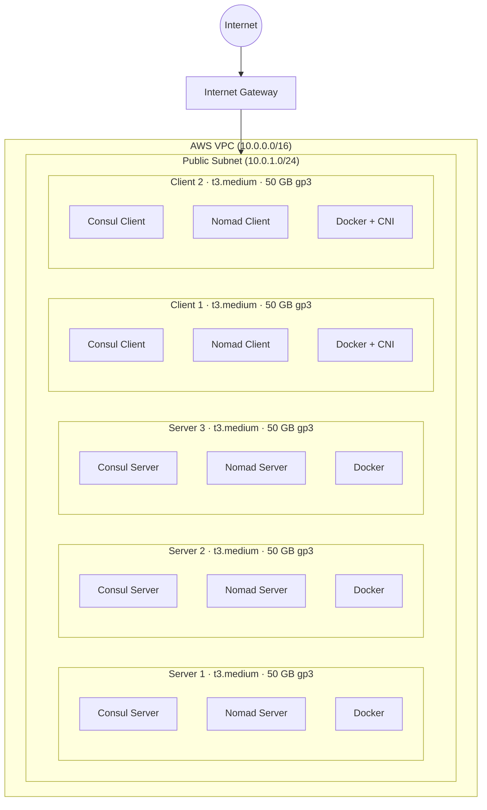

# Nomad Infrastructure

Infrastructure-as-Code for deploying a co-located HashiCorp Consul and Nomad
cluster on AWS using Terraform and Ansible.

We tested this infrastructure with the following versions:

| Software | Version |
|----------|---------|
| HashiCorp Nomad | 2.0.4 |
| HashiCorp Consul | 2.0.1 |
| Terraform | ≥ 1.0 |
| AWS Terraform provider | ~> 5.0 |
| Ansible | ≥ 2.14 |
| CNI plugins | 1.9.1 |
| Docker CE | latest |
| Ubuntu | 24.04 LTS |

## Overview

This project provisions a production-ready cluster of **3 servers and 2 clients** on AWS. Every node runs co-located Consul and Nomad agents, providing a service-discovery and service-mesh layer (Consul) alongside a workload-orchestration layer (Nomad) on the same infrastructure.

**[Complete Deployment Guide](DEPLOY_CLUSTER_GUIDE.MD)** — Step-by-step instructions for deploying your cluster.

### What gets deployed

| Layer | Technology | Version |
|-------|-----------|---------|
| Service discovery & mesh | HashiCorp Consul | 2.0.1 |
| Workload orchestration | HashiCorp Nomad | 2.0.4 |
| Container runtime | Docker CE | latest |
| Container networking | CNI plugins | (clients only) |
| DNS forwarding | dnsmasq | (all nodes) |
| Operating system | Ubuntu 24.04 LTS | latest AMI |

### Key features

- **Co-located cluster**: Consul and Nomad agents run side-by-side on every node
- **Consul Cloud Auto-Join**: Consul discovers peers automatically using the `AutoJoinRole` EC2 tag — no hardcoded IPs
- **Nomad static join**: Nomad uses private IPs from the Ansible inventory for `server_join.retry_join`
- **IAM-powered discovery**: EC2 instance profiles grant least-privilege `ec2:DescribeInstances` access for Consul Cloud Auto-Join
- **TLS-ready**: Certificate generation and distribution are wired in. Enable them per playbook with `nomad_tls_enabled: true` or `consul_tls_enabled: true`.
- **ACL-ready**: Consul ACLs are enabled on servers by default. Nomad ACLs are enabled on all nodes by default. Each has a dedicated bootstrap playbook.
- **Consul service discovery**: Nomad integrates with Consul using Workload Identities (JWT-based, Nomad 1.7+) with no shared static tokens. Nomad services and tasks obtain scoped Consul ACL tokens automatically.
- **dnsmasq DNS forwarding**: Every node runs dnsmasq to forward `.consul` DNS queries to the local Consul agent, enabling service address resolution for all processes
- **CNI + Docker**: Clients install CNI plugins and Docker CE for containerized workloads
- **Idempotent**: Safe to re-run Terraform and Ansible repeatedly

## Architecture



### Node roles

| Node type | Consul agent | Nomad agent | Docker | CNI plugins |
|-----------|-------------|------------|--------|-------------|
| Server (×3) | Server | Server | ✓ | — |
| Client (×2) | Client | Client | ✓ | ✓ |

### Cluster discovery

| Service | Discovery method |
|---------|----------------|
| Consul | AWS Cloud Auto-Join — queries EC2 API for instances tagged `AutoJoinRole=server` |
| Nomad | Static `server_join.retry_join` — private IPs from the `[servers]` inventory group |

### Open ports

| Port | Protocol | Service | Accessible from |
|------|----------|---------|----------------|
| 22 | TCP | SSH | `allowed_ssh_cidr` |
| 8500 | TCP | Consul HTTP API & UI | `0.0.0.0/0` |
| 8300 | TCP | Consul RPC | Internal (security group) |
| 8301 | TCP/UDP | Consul Serf LAN | Internal (security group) |
| 4646 | TCP | Nomad HTTP API & UI | `0.0.0.0/0` |
| all | all | Internal cluster traffic | Internal (security group) |

Restrict these in production. Refer to [ansible/README-SECURITY-GROUP.md](ansible/README-SECURITY-GROUP.md).

## Prerequisites

### Required tools

- **Terraform** ≥ 1.0
- **Ansible** ≥ 2.14
- **AWS CLI** configured with credentials that can manage EC2, VPC, IAM, and key pairs

### Ansible collections and roles

Install before running any playbook:

```bash
cd ansible
ansible-galaxy install -r requirements.yaml
```

## Quick start

**For full step-by-step instructions, refer to [DEPLOY_CLUSTER_GUIDE.MD](DEPLOY_CLUSTER_GUIDE.MD).**

### 1. Provision infrastructure

```bash
cd terraform/aws
cp terraform.tfvars.example terraform.tfvars
# Edit terraform.tfvars — set aws_region, owner, and allowed_ssh_cidr at minimum

terraform init
terraform plan
terraform apply
```

Terraform creates the VPC, EC2 instances, IAM roles, SSH key pair, and writes `ansible/inventory.ini` automatically.

### 2. Install Ansible dependencies

```bash
cd ansible
ansible-galaxy install -r requirements.yaml
```

### 3. Choose a deployment scenario

| Playbook | What it deploys | Use when |
|----------|----------------|----------|
| [`deploy_consul.yaml`](ansible/deploy_consul.yaml) | Consul servers + clients + ACL + dnsmasq | Consul-only service mesh or DNS |
| [`deploy_nomad.yaml`](ansible/deploy_nomad.yaml) | Nomad servers + clients + ACL | Nomad-only workload orchestration |
| [`deploy_consul_nomad_sd.yaml`](ansible/deploy_consul_nomad_sd.yaml) | Consul + Nomad + service discovery | Nomad registers services and health checks through Consul |
| [`deploy_consul_nomad_wi.yaml`](ansible/deploy_consul_nomad_wi.yaml) | Consul + Nomad + service discovery + workload identity | Nomad workloads obtain scoped Consul tokens automatically |

Each playbook configures all hosts, tests Ansible connectivity, deploys the named services, and prints a cluster status summary with access tokens and environment variable export commands. Refer to [ansible/PLAYBOOKS-README.md](ansible/PLAYBOOKS-README.md) for full details on each scenario.

#### Use case 1: Consul cluster only

Deploys Consul servers and clients, bootstraps Consul ACL, and configures dnsmasq for `.consul` DNS forwarding on all nodes.

```bash
ansible-playbook -i inventory.ini deploy_consul.yaml
```

#### Use case 2: Nomad cluster only

Deploys Nomad servers and clients and bootstraps Nomad ACL. No Consul integration.

```bash
ansible-playbook -i inventory.ini deploy_nomad.yaml
```

#### Use case 3: Consul + Nomad with service discovery

Deploys a full Consul cluster and a full Nomad cluster, then configures Consul ACL policies and Nomad agent tokens so Nomad uses Consul for service registration and health checks.

```bash
ansible-playbook -i inventory.ini deploy_consul_nomad_sd.yaml
```

#### Use case 4: Consul + Nomad with service discovery and workload identity

Extends use case 3 by configuring a Consul JWT auth method and adding `service_identity`/`task_identity` blocks to Nomad server configuration. Nomad workloads exchange a short-lived JWT for a scoped Consul ACL token at runtime — no static secrets required in job files.

```bash
ansible-playbook -i inventory.ini deploy_consul_nomad_wi.yaml
```

### 4. Set environment variables

After any deployment, source the helper script from the `ansible/` directory:

```bash
cd ansible
source ./set-cluster-env.sh

# To unset:
source ./unset-cluster-env.sh
```

The script reads the first server IP from `inventory.ini` and the bootstrap token values from the `ansible/tokens/` directory. It skips variables whose token files are not present, so it works correctly for all four deployment scenarios.

To set variables manually:

```bash
export CONSUL_HTTP_ADDR=http://<server-ip>:8500
export CONSUL_HTTP_TOKEN=$(cat ansible/tokens/consul-bootstrap-secret-id.txt)
export NOMAD_ADDR=http://<server-ip>:4646
export NOMAD_TOKEN=$(cat ansible/tokens/nomad-bootstrap-secret-id.txt)
```

### 5. Access the cluster

| Service | URL |
|---------|-----|
| Consul UI | `http://<server-ip>:8500/ui` |
| Nomad UI | `http://<server-ip>:4646` |

## Configuration

### Terraform variables

| Variable | Default | Description |
|----------|---------|-------------|
| `aws_region` | `us-east-2` | AWS region |
| `project_name` | `nomad-consul` | Resource name prefix |
| `owner` | `devops-team` | Owner tag |
| `environment` | `dev` | Environment tag |
| `vpc_cidr` | `10.0.0.0/16` | VPC CIDR block |
| `subnet_cidr` | `10.0.1.0/24` | Public subnet CIDR |
| `allowed_ssh_cidr` | `0.0.0.0/0` | CIDR allowed for SSH |
| `server_count` | `3` | Number of server EC2 instances |
| `client_count` | `2` | Number of client EC2 instances |
| `server_instance_type` | `t3.medium` | Server EC2 instance type |
| `client_instance_type` | `t3.medium` | Client EC2 instance type |

Always set `allowed_ssh_cidr` to your specific IP address or network range.

### Ansible variables — Consul

Defaults: [`ansible/roles/consul/defaults/main.yaml`](ansible/roles/consul/defaults/main.yaml)

| Variable | Default | Description |
|----------|---------|-------------|
| `consul_binary_version` | `2.0.1` | Consul release to install |
| `consul_datacenter` | `dc1` | Datacenter name |
| `consul_server_enabled` | `false` | Enable server mode |
| `consul_server_bootstrap_expect` | `3` | Quorum size |
| `consul_cloud_auto_join_enabled` | `false` | Enable AWS Cloud Auto-Join |
| `consul_acl_enabled` | `false` | Enable ACLs |
| `consul_tls_enabled` | `false` | Enable TLS |

### Ansible variables — Nomad

Defaults: [`ansible/roles/nomad/defaults/main.yaml`](ansible/roles/nomad/defaults/main.yaml)

| Variable | Default | Description |
|----------|---------|-------------|
| `nomad_binary_version` | `2.0.4` | Nomad release to install |
| `nomad_server_enabled` | `false` | Enable server mode |
| `nomad_server_bootstrap_expect` | `3` | Quorum size |
| `nomad_client_enabled` | `false` | Enable client mode |
| `nomad_cloud_auto_join_enabled` | `false` | Enable AWS Cloud Auto-Join |
| `nomad_acl_enabled` | `false` | Enable ACLs |
| `nomad_tls_enabled` | `false` | Enable TLS |
| `nomad_log_level` | `DEBUG` | Log level |

## Network security

The security group allows:

- **SSH (22)**: From `allowed_ssh_cidr`. The default value `0.0.0.0/0` is not appropriate for production. Set this to your specific IP address or network range.
- **Consul HTTP API/UI (8500)**: From `0.0.0.0/0`. Restrict this in production.
- **Nomad HTTP API/UI (4646)**: From `0.0.0.0/0`. Restrict this in production.
- **All internal traffic**: Between instances sharing the security group
- **Egress**: All outbound traffic allowed

Refer to [ansible/README-SECURITY-GROUP.md](ansible/README-SECURITY-GROUP.md) for hardening guidance.

## IAM permissions

Every EC2 instance receives an IAM instance profile with the following permissions for Consul Cloud Auto-Join:

- `ec2:DescribeInstances`
- `ec2:DescribeTags`
- `autoscaling:DescribeAutoScalingGroups`

## Project structure

```
nomad-infra/
├── README.md                             # This file
├── DEPLOY_CLUSTER_GUIDE.MD                         # Full deployment walkthrough
├── AGENTS.md                             # Coding agent guidelines
├── terraform/
│   └── aws/
│       ├── main.tf                       # Provider configuration
│       ├── variables.tf                  # Input variables
│       ├── outputs.tf                    # Output values
│       ├── ami.tf                        # Ubuntu 24.04 AMI lookup
│       ├── network.tf                    # VPC, subnet, security group
│       ├── compute.tf                    # EC2 instances + inventory generation
│       ├── iam.tf                        # IAM role for cloud auto-join
│       ├── keypair.tf                    # SSH key pair
│       ├── inventory.tpl                 # Ansible inventory template
│       ├── terraform.tfvars.example      # Variable examples
│       └── README.md                     # Terraform reference
└── ansible/
    ├── ansible.cfg                       # Ansible configuration
    ├── requirements.yaml                 # Galaxy roles (geerlingguy.docker)
    ├── inventory.ini                     # Auto-generated by Terraform
    ├── ssh_key.pem                       # Auto-generated SSH private key
    ├── deploy_consul.yaml                # Use case: Consul cluster only
    ├── deploy_nomad.yaml                 # Use case: Nomad cluster only
    ├── deploy_consul_nomad_sd.yaml       # Use case: Consul + Nomad + service discovery
    ├── deploy_consul_nomad_wi.yaml       # Use case: Consul + Nomad + SD + workload identity
    ├── teardown.yaml                     # Teardown playbook
    ├── set-cluster-env.sh                # Source to set CONSUL/NOMAD env vars
    ├── unset-cluster-env.sh              # Source to unset CONSUL/NOMAD env vars
    ├── tokens/                           # ACL bootstrap token files (auto-created, git-ignored)
    ├── playbooks/                        # Sub-playbooks (imported by use case entrypoints)
    │   ├── consul_servers.yaml           # Consul server configuration
    │   ├── consul_clients.yaml           # Consul client configuration
    │   ├── consul_acl_bootstrap.yaml     # Consul ACL bootstrap
    │   ├── consul_acl_deny_anonymous.yaml    # Deny Consul anonymous token
    │   ├── consul_nomad_integration.yaml # Consul-Nomad integration orchestrator
    │   ├── consul_nomad_service_discovery.yaml  # Consul ACL policies + Nomad tokens
    │   ├── consul_nomad_workload_identity.yaml  # JWT auth method + binding rules
    │   ├── nomad_servers.yaml            # Nomad server configuration
    │   ├── nomad_clients.yaml            # Nomad client configuration
    │   ├── nomad_acl_bootstrap.yaml      # Nomad ACL bootstrap
    │   ├── dnsmasq.yaml                  # dnsmasq DNS forwarding
    │   ├── cluster_summary.yaml          # Cluster status and token summary
    │   └── common_setup.yaml             # Shared host pre-tasks
    ├── PLAYBOOKS-README.md               # Playbook reference
    ├── BOOTSTRAP_ACL_EXAMPLE.md          # ACL bootstrap walkthrough
    ├── README-SECURITY-GROUP.md          # Security group hardening guide
    └── roles/
        ├── common/                       # Base system setup
        ├── cni/                          # CNI plugins (clients only)
        ├── hashicorp_release/            # HashiCorp binary installer
        ├── helper/                       # File and package utilities
        ├── consul/                       # Consul install and configure
        ├── nomad/                        # Nomad install and configure
        ├── nomad_consul/                 # Consul ACL resources for Nomad integration
        └── tls/                          # TLS certificate generation
```

## Sensitive files

The following files are git-ignored and must never be committed:

| File | Contents |
|------|----------|
| `ansible/ssh_key.pem` | SSH private key for all EC2 instances |
| `ansible/.tls/` | Generated TLS certificates |
| `ansible/tokens/consul-bootstrap-token-output.txt` | Consul management ACL token |
| `ansible/tokens/consul-bootstrap-secret-id.txt` | Consul ACL SecretID |
| `ansible/tokens/nomad-bootstrap-token-output.txt` | Nomad management ACL token |
| `ansible/tokens/nomad-bootstrap-secret-id.txt` | Nomad ACL SecretID |
| `ansible/tokens/nomad-consul-server-token-output.txt` | Full Consul token output for Nomad server agents |
| `ansible/tokens/nomad-consul-server-secret-id.txt` | Consul token SecretID for Nomad server agents |
| `ansible/tokens/nomad-consul-client-token-output.txt` | Full Consul token output for Nomad client agents |
| `ansible/tokens/nomad-consul-client-secret-id.txt` | Consul token SecretID for Nomad client agents |
| `terraform/aws/terraform.tfvars` | AWS credentials and configuration |

## Cleanup

```bash
cd terraform/aws
terraform destroy
```

This permanently removes all EC2 instances, VPC, subnet, IAM roles, and SSH key pairs created by this project.
