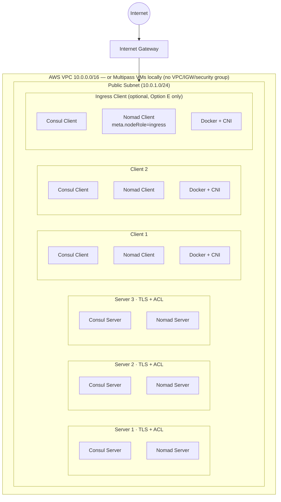

# Nomad infrastructure

Infrastructure-as-Code for deploying a co-located HashiCorp Consul and Nomad
cluster on AWS using Terraform and Ansible.

We tested this infrastructure with the following versions:

| Software | Version |
|----------|---------|
| HashiCorp Nomad | 2.0.4 |
| HashiCorp Consul | 2.0.2 |
| HashiCorp Vault | 1.20.1 |
| Terraform | ≥ 1.0 |
| AWS Terraform provider | ~> 5.0 |
| Ansible | ≥ 2.14 |
| CNI plugins | 1.9.1 |
| Docker CE | latest |
| Ubuntu | 24.04 LTS |

Nomad, Consul, and CNI/Vault versions are pinned in
[`ansible/group_vars/all.yaml`](ansible/group_vars/all.yaml) — that file is
the single source of truth if this table drifts out of date again.

## Overview

This project provisions a production-ready cluster of three servers and two
clients on AWS or locally with Multipass. Every node runs co-located Consul and
Nomad agents, providing a service-discovery and service-mesh layer (Consul)
alongside a workload-orchestration layer (Nomad) on the same infrastructure.

Repo purpose:

- Education engineers and tech writers can spin up an AWS or Multipass cluster for learning the products and testing features.
- Use in conjunction with a tutorial. Modify tutorials to instruct user what playbook to run to create environment for tutorial.
- Use to spin up a cluster in Instruqt sandbox (TBD since full cluster creation takes 15 mins).

Goals:

- Definable, repeatable infrastructure creation/destroy with Terraform
- Definable, repeatable cluster creation/teardown with Ansible
- Modular approach with top-level playbooks that call playbooks relevant to the
use case.
- Expandable in the future to add more playbooks for new scenarios.

**[Complete Deployment Guide](DEPLOY_CLUSTER_GUIDE.md)** — Step-by-step instructions for deploying your cluster.

### What gets deployed

| Layer | Technology | Version |
|-------|-----------|---------|
| Service discovery & mesh | HashiCorp Consul | 2.0.2 |
| Workload orchestration | HashiCorp Nomad | 2.0.4 |
| Container runtime | Docker CE | latest |
| Container networking | CNI plugins | (clients only) |
| DNS forwarding | dnsmasq | (all nodes) |
| Operating system | Ubuntu 24.04 LTS | latest AMI |

### Key features

- **Co-located cluster**: Consul and Nomad agents run side-by-side on every node
- **Consul Cloud Auto-Join**: Consul discovers peers automatically using the `AutoJoinRole` EC2 tag — no hardcoded IPs
- **Nomad static join**: Nomad uses private IPs from the Ansible inventory for `server_join.retry_join`
- **IAM-powered discovery**: EC2 instance profiles grant least-privilege `ec2:DescribeInstances` access for Consul Cloud Auto-Join
- **TLS by default**: Consul and Nomad both enable TLS by default (`consul_tls_enabled: true`, `nomad_tls_enabled: true`). Certificates are self-signed by the `tls` role and distributed automatically. Consul serves plain HTTP on `127.0.0.1:8500` (loopback only) alongside HTTPS on `0.0.0.0:8443`; Nomad's HTTP and RPC layers are TLS-only.
- **ACL-ready**: Consul ACLs are enabled on servers by default. Nomad ACLs are enabled on all nodes by default. Each has a dedicated bootstrap playbook.
- **Consul service discovery**: Nomad integrates with Consul using Workload Identities (JWT-based, Nomad 1.7+) with no shared static tokens. Nomad services and tasks obtain scoped Consul ACL tokens automatically.
- **dnsmasq DNS forwarding**: Every node runs dnsmasq to forward `.global` DNS queries to the local Consul agent, enabling service address resolution for all processes
- **CNI + Docker**: Clients install CNI plugins and Docker CE for containerized workloads
- **Idempotent**: Safe to re-run Terraform and Ansible repeatedly

## Architecture



This is the shared server/client topology every scenario in
[DEPLOY_CLUSTER_GUIDE.md](DEPLOY_CLUSTER_GUIDE.md) provisions on top of; which
agents/services actually run depends on which `deploy_*.yaml` scenario you
choose. The ingress client only exists when `ingress_client_count = 1`
(Option E — service mesh + API Gateway). Option F (Nomad + Vault) uses the
same server/client shape without Consul, plus Vault on each server — see the
guide for the full breakdown of all seven scenarios.

### Node roles

| Node type | Consul agent | Nomad agent | Docker | CNI plugins |
|-----------|-------------|------------|--------|-------------|
| Server (×3) | Server | Server | ✓ | — |
| Client (×2, internal) | Client | Client | ✓ | ✓ |
| Ingress client (×0–1, optional) | Client | Client, `meta.nodeRole=ingress` | ✓ | ✓ |

### Cluster discovery

| Service | Discovery method |
|---------|----------------|
| Consul | AWS: Cloud Auto-Join — queries EC2 API for instances tagged `AutoJoinRole=server`. Multipass: static `retry_join` from inventory (no cloud API available) |
| Nomad | Static `server_join.retry_join` — private IPs from the `[servers]` inventory group, on either platform |

## Project structure

```
nomad-infrastructure/
├── README.md                             # This file
├── DEPLOY_CLUSTER_GUIDE.md                # Full deployment walkthrough (all 7 scenarios)
├── TEST_PLAN.md                          # Reviewer checklist: every scenario × AWS/Multipass
├── AGENTS.md                             # Coding agent guidelines
├── .github/
│   ├── skills/                           # Claude Code skills (deploy-scenario, pr-description)
│   └── plans/                            # Version-upgrade plans
├── _context/wiki/                        # Design-decision and troubleshooting knowledge base
├── terraform/
│   ├── aws/                               # AWS provisioning workspace
│   │   ├── main.tf                       # Provider configuration
│   │   ├── variables.tf                  # Input variables
│   │   ├── outputs.tf                    # Output values
│   │   ├── ami.tf                        # Ubuntu 24.04 AMI lookup
│   │   ├── network.tf                    # VPC, subnet, security groups
│   │   ├── compute.tf                    # EC2 instances + inventory generation
│   │   ├── iam.tf                        # IAM role for cloud auto-join
│   │   ├── keypair.tf                    # SSH key pair
│   │   ├── loadbalancer.tf               # Optional external ALB
│   │   ├── inventory.tpl                 # Ansible inventory template
│   │   ├── terraform.tfvars.example      # Variable examples
│   │   └── README.md                     # Terraform reference
│   └── multipass/                        # Local Multipass VM workspace (same shape as aws/)
├── nomad-jobs/                            # Demo app job specs
│   ├── nomad-sd/                         # Countdash — Nomad-native service discovery
│   ├── consul-sd/                        # Countdash / HashiCups — Consul service discovery
│   └── consul-mesh/                      # Countdash / HashiCups — service mesh + API Gateway (Option E)
└── ansible/
    ├── ansible.cfg                       # Ansible configuration
    ├── requirements.yaml                 # Galaxy roles (geerlingguy.docker)
    ├── group_vars/all.yaml               # Version pins (single source of truth)
    ├── inventory.ini                     # Auto-generated by Terraform
    ├── ssh_key.pem                       # Auto-generated SSH private key (AWS only)
    ├── deploy_get_started.yaml           # Use case: single-node, no Consul/TLS/ACL
    ├── deploy_consul.yaml                # Use case: Consul cluster only
    ├── deploy_nomad.yaml                 # Use case: Nomad cluster only
    ├── deploy_consul_nomad_sd.yaml       # Use case: Consul + Nomad + service discovery
    ├── deploy_consul_nomad_wi.yaml       # Use case: Consul + Nomad + SD + workload identity
    ├── deploy_consul_nomad_mesh.yaml     # Use case: + service mesh + API Gateway
    ├── deploy_nomad_vault.yaml           # Use case: Nomad + Vault workload identity
    ├── teardown.yaml                     # Teardown playbook
    ├── set-cluster-env.sh                # Source to set CONSUL/NOMAD/VAULT env vars
    ├── unset-cluster-env.sh              # Source to unset those env vars
    ├── tokens/                           # ACL/Vault token files (auto-created, git-ignored)
    ├── playbooks/                        # Sub-playbooks imported by the entrypoints above —
    │                                     # see ansible/PLAYBOOKS-README.md for the full list
    ├── PLAYBOOKS-README.md               # Playbook reference
    ├── BOOTSTRAP_ACL_EXAMPLE.md          # ACL bootstrap walkthrough
    ├── README-SECURITY-GROUP.md          # Security group hardening guide
    └── roles/
        ├── common/                       # Base system setup
        ├── cni/                          # CNI plugins (clients only)
        ├── hashicorp_release/            # HashiCorp binary installer
        ├── helper/                       # File and package utilities
        ├── consul/                       # Consul install and configure
        ├── nomad/                        # Nomad install and configure
        ├── nomad_consul/                 # Consul ACL resources for Nomad integration
        ├── nomad_vault/                  # Vault JWT auth method for Nomad workload identity
        ├── vault/                        # Vault install and configure
        ├── dnsmasq/                      # .global DNS forwarding
        └── tls/                          # TLS certificate generation
```

## Sensitive files

The following files are git-ignored and must never be committed:

| File | Contents |
|------|----------|
| `ansible/ssh_key.pem` | SSH private key for all EC2 instances (AWS only — Multipass reuses your existing local key) |
| `ansible/.tls/` | Generated TLS certificates, including the shared CA private key |
| `ansible/tokens/consul-bootstrap-token-output.txt` | Consul management ACL token |
| `ansible/tokens/consul-bootstrap-secret-id.txt` | Consul ACL SecretID |
| `ansible/tokens/consul-dns-secret-id.txt` | Consul DNS-access ACL token |
| `ansible/tokens/consul-client-agent-<node>-secret-id.txt` | Per-node Consul agent (node-identity) token |
| `ansible/tokens/nomad-bootstrap-token-output.txt` | Nomad management ACL token |
| `ansible/tokens/nomad-bootstrap-secret-id.txt` | Nomad ACL SecretID |
| `ansible/tokens/nomad-consul-server-secret-id.txt` | Consul token SecretID for Nomad server agents |
| `ansible/tokens/nomad-consul-client-secret-id.txt` | Consul token SecretID for Nomad client agents |
| `ansible/tokens/vault-init-output.txt` | Full Vault initialization output |
| `ansible/tokens/vault-root-token-secret-id.txt` | Vault root token |
| `ansible/tokens/vault-unseal-key.txt` | Vault unseal key |
| `terraform/aws/terraform.tfvars` | AWS credentials and configuration |
| `terraform/multipass/terraform.tfvars` | Local SSH key paths and VM sizing overrides |

For cleanup instructions, refer to [DEPLOY_CLUSTER_GUIDE.md](DEPLOY_CLUSTER_GUIDE.md#cleanup).
