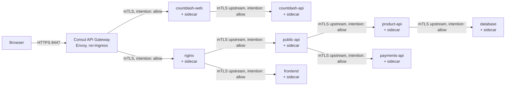
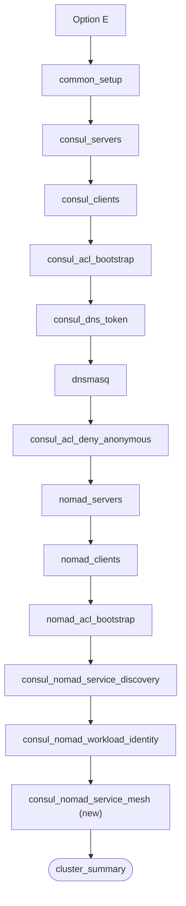

# Plan: Consul service mesh (Option E)

**Status: implemented.** Steps 0–8 of the rollout order are complete and have
been tested against a live AWS cluster, including full documentation.
See the [Rollout order](#rollout-order) for per-step status.

Decisions locked in for this plan (confirmed with the user):

| Decision | Choice |
|----------|--------|
| External ingress | Consul **API Gateway** (Envoy), not static host ports |
| Deploy scenario placement | New **Option E** entrypoint (`deploy_consul_nomad_mesh.yaml`), built on top of Option D |
| Test app scope | Both **Countdash** and **HashiCups** |
| Intentions posture | Explicit allow-list matching the real call graph |
| L7 scope | mTLS + intentions required; one illustrative L7 config entry example included as optional/Phase 2 |

Existing job specs (`countdash-consul-service-discovery.nomad.hcl`,
`countdash-nomad-service-discovery.nomad.hcl`, `hashicups.nomad.hcl`) are
**not modified**. All service mesh functionality ships as new files.

---

## 0. Why this plan requires Option D, not Option C

This was evaluated explicitly because Option D (`deploy_consul_nomad_wi.yaml`)
has not yet been tested in this cluster. The question was whether the mesh
plan could instead build on the already-more-battle-tested Option C
(`deploy_consul_nomad_sd.yaml`, service discovery only, static Consul ACL
tokens, no workload identity).

**Conclusion: no.** Consul Connect sidecars need some way to obtain a scoped
Consul ACL token/certificate at runtime. Nomad has historically supported two
mechanisms:

1. **Legacy static-token derivation** — the Nomad agent's own Consul token
   (already present in Option C: `nomad-server-policy` has `service_prefix
   write` + `acl write`) is used by Nomad itself to mint per-service tokens.
2. **Workload identity (JWT exchange)** — Option D's mechanism: each workload
   gets a short-lived JWT, exchanged for a Consul token via the
   `nomad-workloads` auth method.

When researching this plan, the current Nomad documentation's **baseline**
"Secure Nomad jobs with Consul service mesh" tutorial sets up workload
identity as a first step, not as an advanced/optional hardening measure —
strong evidence that the legacy static-token path for Connect+ACLs is
deprecated or removed in the Nomad/Consul version lineage this project is
pinned to (see the version-verification caveat in [§4](#4-consul-agent-config-changes)).

Building the mesh on Option C alone would **not** avoid needing workload
identity — it would require reimplementing the JWT auth method, binding
rules, and `service_identity`/`task_identity` blocks from scratch inside a
new, never-tested playbook, instead of reusing the already-written
`consul_nomad_workload_identity.yaml`. That is strictly more risk and more
new code than building on Option D, not less.

**The actual problem to solve is that Option D is untested, not that Option
D is the wrong foundation.** The fix is to validate Option D by itself,
isolated from the mesh work, so a later failure can be attributed to the
right layer. See Phase 0 in the [Rollout order](#rollout-order).

---

## 1. What changes conceptually vs. what you already have

| Layer | Question it answers | Status |
|---|---|---|
| Service discovery (Consul DNS, `.global`) | Where is this service running? | ✅ Already deployed (Option C/D) |
| Workload identity (JWT → Consul ACL token) | Is this Nomad task allowed to register/read the Consul catalog? | ✅ Already deployed (Option D, `consul_nomad_workload_identity.yaml`) |
| **Service mesh (Consul Connect)** | Is this specific caller service allowed to open a connection to this specific callee service, and is the connection encrypted (mTLS)? | ❌ This plan |

Service mesh does **not** replace service discovery or workload identity — it
builds on both. The existing `nomad-workloads` JWT auth method and its
service-identity binding rule (created in
[`consul_nomad_workload_identity.yaml`](../../ansible/playbooks/consul_nomad_workload_identity.yaml))
already grant each Nomad service a Consul **service identity** token when it
registers. Consul's built-in service-identity ACL template automatically
includes `service:write` for both `<name>` and `<name>-sidecar-proxy` — this
is what makes Envoy sidecar registration work with **no new Consul ACL
resource** for the sidecars themselves. Only the API Gateway (a separate kind
of workload) needs a new binding rule (see [§5](#5-consul-acl-changes)).

---

## 2. Target architecture



All arrows other than the browser→gateway hop are Envoy sidecar↔sidecar mTLS
connections, authorized by Consul service intentions. Everything not shown as
an explicit arrow is denied (ACL default policy is already `deny`, so
intentions default to `deny` too).

---

## 3. New use case: Option E

`ansible/deploy_consul_nomad_mesh.yaml` — runs everything Option D runs, then
adds the mesh-enabling playbook:



`consul_nomad_service_mesh.yaml` (new playbook) responsibilities:

1. **Play 1 (servers + clients):** re-run the `consul` role with
   `consul_connect_enabled: true` and a non-disabled `grpc_tls` port, so every
   agent restarts with Connect enabled. Includes a `consul_validate` task
   before restart, per project convention.
2. **Play 2 (servers):** re-run the `nomad` role with the new
   `consul.grpc_ca_file` / `consul.grpc_address` fields populated (see
   [§5](#5-nomad-agent-config-changes)) so Nomad can bootstrap Envoy against
   Consul's TLS-enabled gRPC/xDS listener.
3. **Play 3 (servers, `run_once`):** create the Nomad `ingress` namespace and
   the new Consul ACL binding rule for the API Gateway (see
   [§5](#5-consul-acl-changes)). This extends the existing `nomad_consul` role
   (`nomad_consul_run_service_mesh: true`) rather than duplicating its JWT
   auth-method logic — the auth method (`nomad-workloads`) already exists
   from Option D.

---

## 4. Consul agent config changes

File: [`ansible/roles/consul/templates/consul.hcl.j2`](../../ansible/roles/consul/templates/consul.hcl.j2)
— **no template changes needed**, only variable changes, since the template
already has conditional `connect {}` and `grpc_tls` blocks:

| Variable | Current default | New value (Option E) |
|---|---|---|
| `consul_connect_enabled` | `false` | `true` (all servers **and** clients) |
| `consul_port_grpc_tls` | `-1` (disabled) | `8503` (standard gRPC-TLS port, required by Consul 1.14+ when TLS is enabled and Connect is used) |

Rendered `consul.hcl` diff (clients and servers):

```hcl
ports {
  http     = 8500
  https    = 8443
  grpc     = 8502
  grpc_tls = 8503   # was -1
  ...
}

connect {
  enabled = true
}
```

**Open item to verify during implementation:** confirm the pinned
`consul_binary_version` (`2.0.1` in [group_vars/all.yaml](../../ansible/group_vars/all.yaml))
actually supports the `grpc_tls` port and API Gateway config entries
(`api-gateway`, `http-route`, `inline-certificate`). These version numbers
don't correspond to any published HashiCorp Consul release as of this
writing — treat the pinned version as provisional and re-validate against
the actual installed binary's `consul version` and changelog before writing
any playbook code.

---

## 5. Nomad agent config changes

File: [`ansible/roles/nomad/templates/nomad.hcl.j2`](../../ansible/roles/nomad/templates/nomad.hcl.j2)
— **template change required.** The current `consul {}` block only renders
`address`, `token`, `service_identity`, `task_identity`. Add:

```hcl
consul {
  address = "{{ nomad_consul_address }}"
  token   = "{{ nomad_consul_agent_token }}"


  grpc_ca_file  = "{{ consul_tls_dir }}/ca.pem"
  grpc_address  = "127.0.0.1:8503"


  # ...existing service_identity / task_identity blocks unchanged
}
```

This is required per Nomad's documented Consul 1.14+ TLS behavior change:
without `grpc_ca_file` and `grpc_address` pointed at the TLS gRPC port,
Nomad cannot bootstrap the Envoy sidecar against a TLS-enabled Consul agent.

No changes needed to `service_identity` / `task_identity` blocks — those
already exist from Option D and already cover sidecar-proxy service
identities (see [§1](#1-what-changes-conceptually-vs-what-you-already-have)).

**Client readiness check (verification step, not a config change):** after
rollout, confirm each Nomad client fingerprints Connect support:

```bash
nomad node status -verbose <node-id> | grep consul
# consul.connect = true
# consul.grpc    = 8502
```

---

## 5. Consul ACL changes

### New Consul resources

| Resource | Purpose | Created by |
|---|---|---|
| Nomad namespace `ingress` | Isolates the API Gateway job from `default`-namespace app jobs | `consul_nomad_service_mesh.yaml` (`nomad namespace apply`) |
| Consul ACL binding rule: `templated-policy` → `builtin/api-gateway` | Grants the gateway workload identity the built-in API Gateway ACL template, scoped to the gateway's own job | `consul_nomad_service_mesh.yaml` |

Exact binding rule (reuses the existing `nomad-workloads` JWT auth method
created in Option D — no new auth method):

```bash
consul acl binding-rule create \
  -method 'nomad-workloads' \
  -description 'Nomad API gateway' \
  -bind-type 'templated-policy' \
  -bind-name 'builtin/api-gateway' \
  -bind-vars 'Name=${value.nomad_job_id}' \
  -selector '"nomad_service" not in value and value.nomad_namespace==ingress'
```

### Resources that do **not** need to change

- `nomad-server-policy.hcl` — already has `mesh = "write"` (added
  forward-compatibility per [acl-architecture.md](acl-architecture.md)).
- `nomad-tasks-policy.hcl` / `nomad-tasks-default` role — unaffected; only
  used for plain task workload identities (`template` blocks), not sidecars.
- The `nomad_service` → service-identity binding rule from Option D — this
  is what authorizes sidecar-proxy registration for every mesh-enabled
  service automatically.

### Consul service intentions (explicit allow-list)

Applied via `consul config write <file>.hcl` — **not** an Ansible playbook
task, since intentions are an application/job-spec-level concern, not
cluster infrastructure (mirrors how `nomad-jobs/` already documents
`nomad job run` commands in each app's README rather than baking job
submission into Ansible).

| Source | Destination | App |
|---|---|---|
| `countdash-web` | `countdash-api` | Countdash |
| `api-gateway` | `countdash-web` | Countdash |
| `api-gateway` | `nginx` | HashiCups |
| `nginx` | `frontend` | HashiCups |
| `nginx` | `public-api` | HashiCups |
| `public-api` | `product-api` | HashiCups |
| `public-api` | `payments-api` | HashiCups |
| `product-api` | `database` | HashiCups |

Each row becomes one `Kind = "service-intentions"` config entry (one file
per **destination** service, since a destination can have multiple sources —
matching the pattern already used in the `learn-consul-nomad-vm` reference
repo's `04.intentions.consul.sh`).

---

## 6. Networking readiness (CNI, bridge mode)

- CNI plugins are **already installed** on Nomad clients via the existing
  `cni` role (`cni_plugins_version: 1.9.1`, pinned in `group_vars/all.yaml`).
  No new role or version bump needed — bridge networking already works today
  for any job that requests `network { mode = "bridge" }`.
- No changes needed to the `cni` role or its defaults.
- **Not using** `transparent_proxy` mode for this plan (that requires the
  separate `consul-cni` plugin, which is not installed). Job specs will use
  explicit `upstreams` blocks instead — this is the "manually configured
  upstreams" pattern from the Nomad docs, and matches the existing repo
  convention of explicit configuration over auto-discovery magic (e.g.,
  Consul DNS names are already spelled out explicitly in existing job specs
  rather than relying on implicit behavior).

---

## 7. Terraform / security group changes

| Change | File | Detail |
|---|---|---|
| New ingress port for the API Gateway's HTTPS listener | `terraform/aws/terraform.tfvars(.example)` — `extra_ingress_ports` | Add `{ port = 8447, description = "Consul API Gateway - HTTPS ingress" }`. Port chosen to avoid collision with existing 22/8500/8443/4646/9002/443. |
| No change | `terraform/aws/network.tf` | The `self = true` internal-traffic rule already covers Envoy sidecar-to-sidecar mTLS and the default Consul `sidecar_min_port`–`sidecar_max_port` range (21000–21255) — these never need to be reachable from outside the VPC. |

**Note:** this only *adds* a port; it does not remove the existing 9002
(Countdash SD web UI) or 443 (HashiCups SD nginx) rules, since the existing
service-discovery job specs remain valid and unmodified.

---

## 8. New job specs and supporting files (none modify existing files)

| File (new) | Purpose |
|---|---|
| `nomad-jobs/consul-mesh/countdash-consul-service-mesh.nomad.hcl` | Countdash with `network.mode = bridge`, `connect.sidecar_service` on both groups, explicit `upstreams` for `countdash-web` → `countdash-api` |
| `nomad-jobs/consul-mesh/hashicups-consul-service-mesh.nomad.hcl` | HashiCups with `network.mode = bridge` on all 6 groups, sidecars, explicit `upstreams` per the dependency table in `nomad-jobs/consul-sd/README-hashicups.md` |
| `nomad-jobs/consul-mesh/api-gateway.nomad.hcl` (new directory) | Envoy-based Consul API Gateway job in the `ingress` namespace, using workload identity (`identity { name = "consul_default" }`) to bootstrap against Consul — modeled on the `consul-api-gateway-on-nomad` reference pattern |
| `nomad-jobs/consul-mesh/gateway-listener.hcl` | Consul `api-gateway` config entry: HTTPS listener on 8447 |
| `nomad-jobs/consul-mesh/inline-certificate.hcl` | Self-signed cert/key for the gateway's TLS listener (`consul config write`) |
| `nomad-jobs/consul-mesh/http-route-countdash.hcl` | Consul `http-route` config entry routing to `countdash-web` |
| `nomad-jobs/consul-mesh/http-route-hashicups.hcl` | Consul `http-route` config entry routing to `nginx` |
| `nomad-jobs/consul-mesh/intentions/*.hcl` | One `service-intentions` config entry per destination service (table in [§5](#consul-service-intentions-explicit-allow-list)) |
| `nomad-jobs/consul-mesh/README.md` | Deploy order, prerequisites, and Consul Variables/certs setup for the gateway job |

Gateway job needs the Consul CA cert to trust the (shared, self-signed)
Consul TLS listener. Store it as a Nomad Variable in the `ingress` namespace
rather than a bind-mounted file, per the current HashiCorp-recommended
pattern:

```bash
nomad var put -namespace ingress \
  nomad/jobs/api-gateway/gateway/setup \
  consul_cacert=@ansible/.tls/ca.pem
```

**Open item to verify during implementation:** whether the gateway bootstrap
also needs a Consul client certificate/key (some HashiCorp examples pass
`consul_client_cert` / `consul_client_key` alongside the CA cert). This
project's Consul HTTPS listener has `verify_incoming = false`
([tls-enabled-troublshooting.md](tls-enabled-troublshooting.md) /
[AGENTS.md](../../AGENTS.md) security notes) and relies on ACL tokens (via
workload identity), not client-cert mTLS, for API authorization — so the CA
cert alone may be sufficient here. Confirm against the actual gateway
bootstrap error output before assuming client certs are unnecessary.

---

## 9. L7 traffic management (optional / Phase 2)

Required regardless of whether you want traffic-shaping features: Consul's
`http-route` config entries (used by the API Gateway) require destination
services to declare `Protocol = "http"` via a `service-defaults` config
entry. Plan to add one `service-defaults` entry per mesh-enabled service
(`countdash-web`, `countdash-api`, `nginx`, `public-api`, `product-api`,
`payments-api`, `database` [tcp], `frontend`).

Illustrative-only (not required to make the mesh work, included as a
documented example rather than deployed by default): a `service-splitter`
example showing how you'd canary a second version of `countdash-api`, left
commented out in `nomad-jobs/consul-mesh/` since exercising it needs a second
image tag/version, which is out of scope for this pass.

---

## Rollout order

0. **Validate Option D in isolation, before touching the mesh plan.** Deploy
   `deploy_consul_nomad_wi.yaml` on its own (fresh cluster or on top of an
   existing Option C deployment) and confirm:
   - `consul_nomad_workload_identity.yaml` completes without errors
   - `consul acl auth-method read -name nomad-workloads` shows the JWT auth
     method
   - A job using Consul service registration (e.g. the existing
     `countdash-consul-service-discovery.nomad.hcl`) still registers
     correctly and gets a token via workload identity, not a static token
   - `nomad-consul-server-secret-id.txt` / binding rules exist per
     [acl-architecture.md](acl-architecture.md)

   Do not proceed to step 1 until this passes. If it fails, fix Option D
   first — do not attempt to route around it by building the mesh on Option
   C (see [§0](#0-why-this-plan-requires-option-d-not-option-c)).

1. Confirm cluster is already on Option D (or run Option E fresh from
   Terraform apply).
2. Implement and run `consul_nomad_service_mesh.yaml` (Consul Connect +
   Nomad gRPC-TLS config + `ingress` namespace + gateway binding rule).
3. Verify `consul.connect = true` on all Nomad clients.
4. Apply `service-defaults` config entries for all mesh services.
5. Deploy `countdash-consul-service-mesh.nomad.hcl`, apply its two
   intentions, verify end-to-end.
6. Deploy the API Gateway job + listener/http-route/cert config entries,
   apply gateway intentions, verify browser access via port 8447. **Done —
   verified end-to-end** (5/5 consecutive requests through the gateway to
   `countdash-web` returned HTTP 200). Four bugs found and fixed along the
   way, see [api-gateway-envoy-bootstrap-troubleshooting.md](api-gateway-envoy-bootstrap-troubleshooting.md).
7. Deploy `hashicups-consul-service-mesh.nomad.hcl`, apply its five
   intentions, verify end-to-end through the gateway. **Done — verified
   end-to-end.** All 6 groups (db, product-api, payments, public-api,
   frontend, nginx) deployed healthy on the first attempt with 1 passing
   instance each (no stale registrations this time). Swapped the gateway's
   active `http-route` from `countdash` to `hashicups`
   (`consul config delete -kind http-route -name countdash` +
   `consul config write http-route-hashicups.hcl`); 5/5 consecutive
   `curl -sk https://<client-ip>:8447/` requests returned HTTP 200 with the
   actual HashiCups frontend HTML. Intentions spot-checked:
   `api-gateway -> nginx` allowed, `nginx -> database` denied.
8. Update `DEPLOY_CLUSTER_GUIDE.md` (Option E section + mermaid diagram) and
   `nomad-jobs/*/README.md` files — deferred until after step 7 is verified
   working, to avoid documenting an unverified flow. **Done** — added
   Option E to the top-level flowchart, use-case checklist, and a full
   Option E deployment section (mirroring Options A–D) in
   [DEPLOY_CLUSTER_GUIDE.md](../../DEPLOY_CLUSTER_GUIDE.md); added mesh-variant
   cross-references to
   [nomad-jobs/consul-sd/README.md](../../nomad-jobs/consul-sd/README.md) and
   [nomad-jobs/consul-sd/README-hashicups.md](../../nomad-jobs/consul-sd/README-hashicups.md).

All 9 rollout steps (0–8) are now complete and verified against a live AWS
cluster. Both demo apps (Countdash and HashiCups) work end-to-end through the
Consul API Gateway with mTLS and intentions enforced. See
[api-gateway-envoy-bootstrap-troubleshooting.md](api-gateway-envoy-bootstrap-troubleshooting.md)
for the four bugs found and fixed while getting the gateway itself working,
including a Consul-catalog hygiene gotcha (stale sidecar-proxy registrations
surviving a stopped job) that is easy to misattribute back to the gateway.

---

## Verification checklist

- [ ] `consul members` shows all agents healthy after Connect is enabled
- [ ] `nomad node status -verbose <id> | grep consul` shows `consul.connect = true`
- [ ] `consul intention check <src> <dst>` returns `Allowed` only for rows in the intentions table
- [ ] `nomad alloc status` shows a `connect-proxy-*` task for every mesh service allocation
- [ ] Envoy sidecar logs (`nomad alloc logs -task connect-proxy-<svc>`) show no bootstrap errors
- [ ] Countdash dashboard reachable through the gateway, counter increments
- [ ] HashiCups UI reachable through the gateway, checkout flow completes end-to-end
- [ ] Direct pod-to-pod traffic that has **no** intention is refused (spot-check one denied path)

---

## Rollback plan

- Revert `consul_connect_enabled` to `false` and re-run `consul_servers.yaml`
  / `consul_clients.yaml` to restore the pre-mesh agent config.
- Stop mesh job specs (`nomad job stop -purge`); existing service-discovery
  job specs are untouched and can be redeployed immediately.
- `consul config delete -kind service-intentions -name <service>` to remove
  intentions; delete the `ingress` namespace and its binding rule if fully
  rolling back.

---

## Related files

- [acl-architecture.md](acl-architecture.md) — current token/policy inventory this plan extends
- [tls-enabled-by-default-plan.md](tls-enabled-by-default-plan.md) — shared CA this plan reuses for the gateway's Consul trust
- [DEPLOY_CLUSTER_GUIDE.md](../../DEPLOY_CLUSTER_GUIDE.md) — where Option E will be documented once implemented
- [ansible/playbooks/consul_nomad_workload_identity.yaml](../../ansible/playbooks/consul_nomad_workload_identity.yaml) — existing JWT auth method this plan reuses
- [nomad-jobs/consul-sd/README-hashicups.md](../../nomad-jobs/consul-sd/README-hashicups.md) — existing traffic-flow diagram this plan's mesh version extends
