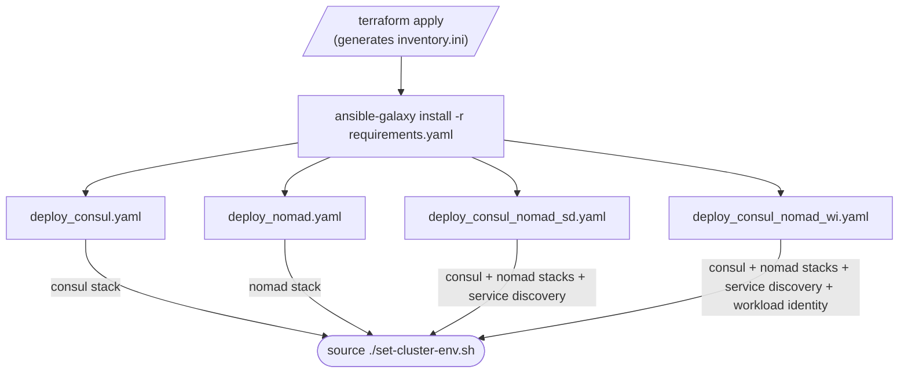

# Ansible Playbooks Reference

This directory contains Ansible playbooks for installing and configuring a co-located HashiCorp Consul v2.0.1 and Nomad v2.0.4 cluster on AWS infrastructure provisioned by Terraform.

All playbooks use the `inventory.ini` file generated by `terraform apply`. Run all commands from the `ansible/` directory.

## Playbook structure

Playbooks are organized into two levels:

- **Use case entrypoints** (`ansible/*.yaml`): `deploy_consul.yaml`, `deploy_nomad.yaml`, `deploy_consul_nomad_sd.yaml`, `deploy_consul_nomad_wi.yaml`, `teardown.yaml`. These are the recommended entry points. Each one imports sub-playbooks in the correct order.
- **Sub-playbooks** (`ansible/playbooks/*.yaml`): Individual layer playbooks you can run directly for targeted operations.

## Playbook dependency order

Choose one of the four use case playbooks as the entry point. Each runs the correct sequence of individual playbooks automatically.



**Rules:**

- Always run `consul_servers.yaml` before `consul_clients.yaml`.
- Always run Consul ACL bootstrap (`consul_acl_bootstrap.yaml`) before any `consul_nomad_*.yaml` playbook.
- Always run `dnsmasq.yaml` after Consul is running and before starting Nomad.
- Always run `nomad_servers.yaml` before `nomad_clients.yaml`.
- Run the Consul layer fully before the Nomad layer.
- Run `consul_nomad_service_discovery.yaml` only after both Consul ACL and Nomad are running.
- Run `consul_nomad_workload_identity.yaml` only after `consul_nomad_service_discovery.yaml`.

---

## Use case playbooks

These four playbooks are the recommended entry points for deployment. Each one runs from start to finish: it configures all hosts, tests Ansible connectivity, deploys the services for that scenario, and prints a cluster status summary that includes access tokens and ready-to-paste environment variable export commands.

Run all commands from the `ansible/` directory.

---

### deploy_consul.yaml — Consul cluster

Deploys a complete Consul cluster with ACL and DNS forwarding. Use this when you need only Consul for service discovery and service mesh, without Nomad.

**Steps executed:**

| # | Action |
|---|--------|
| 1 | Configure all hosts (passwordless sudo, display host info) |
| 2 | Test Ansible connectivity (ping all hosts) |
| 3 | `consul_servers.yaml` — Consul server agents on `[servers]` |
| 4 | `consul_clients.yaml` — Consul client agents on `[clients]` |
| 5 | `consul_acl_bootstrap.yaml` — bootstrap Consul ACL |
| 6 | `consul_dns_token.yaml` — create `dns-access` policy, DNS token, and per-node node-identity tokens; reconfigure Consul clients with ACL enabled |
| 7 | `dnsmasq.yaml` — configure `.global` DNS forwarding on all nodes |
| 8 | `consul_acl_deny_anonymous.yaml` — deny unauthenticated requests |
| 9 | Cluster status summary |

**Usage:**

```bash
ansible-playbook -i inventory.ini deploy_consul.yaml
```

**Status summary outputs:**
- Consul bootstrap token
- `export CONSUL_HTTP_ADDR=http://<server-ip>:8500`
- `export CONSUL_HTTP_TOKEN=<token>`
- SSH access commands and Consul UI URL

---

### deploy_nomad.yaml — Nomad cluster

Deploys a standalone Nomad cluster with ACL. No Consul integration. Use this when you need only Nomad for workload orchestration.

**Steps executed:**

| # | Action |
|---|--------|
| 1 | Configure all hosts |
| 2 | Test Ansible connectivity |
| 3 | `nomad_servers.yaml` — Nomad server agents on `[servers]` |
| 4 | `nomad_clients.yaml` — Nomad client agents on `[clients]` |
| 5 | `nomad_acl_bootstrap.yaml` — bootstrap Nomad ACL |
| 6 | Cluster status summary |

**Usage:**

```bash
ansible-playbook -i inventory.ini deploy_nomad.yaml
```

**Status summary outputs:**
- Nomad bootstrap token
- `export NOMAD_ADDR=http://<server-ip>:4646`
- `export NOMAD_TOKEN=<token>`
- SSH access commands and Nomad UI URL

---

### deploy_consul_nomad_sd.yaml — Consul + Nomad with service discovery

Deploys a full Consul cluster and a full Nomad cluster and then runs the service discovery integration. Consul ACL policies and scoped agent tokens are created for Nomad server and client agents, and Nomad is reconfigured with the `consul { address token }` block.

**Steps executed:**

| # | Action |
|---|--------|
| 1 | Configure all hosts |
| 2 | Test Ansible connectivity |
| 3 | `consul_servers.yaml` |
| 4 | `consul_clients.yaml` |
| 5 | `consul_acl_bootstrap.yaml` |
| 6 | `consul_dns_token.yaml` — create DNS token and node-identity tokens; reconfigure clients with ACL enabled |
| 7 | `dnsmasq.yaml` |
| 8 | `consul_acl_deny_anonymous.yaml` |
| 9 | `nomad_servers.yaml` |
| 10 | `nomad_clients.yaml` |
| 11 | `nomad_acl_bootstrap.yaml` |
| 12 | `consul_nomad_service_discovery.yaml` — Consul ACL policies, Nomad agent tokens, Nomad `consul {}` block |
| 13 | Cluster status summary |

**Usage:**

```bash
ansible-playbook -i inventory.ini deploy_consul_nomad_sd.yaml
```

**Status summary outputs:**
- Consul bootstrap token, Nomad bootstrap token
- Nomad server → Consul agent token, Nomad client → Consul agent token
- `export CONSUL_HTTP_ADDR=...`, `export CONSUL_HTTP_TOKEN=...`
- `export NOMAD_ADDR=...`, `export NOMAD_TOKEN=...`
- SSH access commands and both UI URLs

To add workload identity later on top of this deployment:

```bash
ansible-playbook -i inventory.ini playbooks/consul_nomad_workload_identity.yaml
```

---

### deploy_consul_nomad_wi.yaml — Consul + Nomad with service discovery and workload identity

Deploys everything in `deploy_consul_nomad_sd.yaml` and then adds workload identity. A Consul JWT auth method (`nomad-workloads`) is created that validates JWTs from Nomad's JWKS endpoint, and Nomad server configuration is updated with `service_identity` and `task_identity` blocks. Nomad workloads exchange a short-lived JWT for a scoped Consul ACL token at runtime — no static secrets required in job files.

**Steps executed:**

| # | Action |
|---|--------|
| 1–12 | Same as `deploy_consul_nomad_sd.yaml` |
| 13 | `consul_nomad_workload_identity.yaml` — JWT auth method, ACL binding rules, Nomad server config update |
| 14 | Cluster status summary |

**Usage:**

```bash
ansible-playbook -i inventory.ini deploy_consul_nomad_wi.yaml
```

**Status summary outputs:**
- Same as `deploy_consul_nomad_sd.yaml`

Verify the JWT auth method after deployment:

```bash
consul acl auth-method list
```

---

## Environment scripts

### set-cluster-env.sh

Sets `CONSUL_HTTP_ADDR`, `CONSUL_HTTP_TOKEN`, `NOMAD_ADDR`, and `NOMAD_TOKEN` by reading the first server IP from `inventory.ini` and the token values from the `ansible/tokens/` directory.

Only the variables whose token files exist are set. For example, after running `deploy_nomad.yaml` only `NOMAD_ADDR` and `NOMAD_TOKEN` are set.

```bash
# Must be sourced, not executed directly
source ./set-cluster-env.sh
```

Example output:

```
Setting cluster environment variables (server: 1.2.3.4):

  CONSUL_HTTP_ADDR=http://1.2.3.4:8500
  CONSUL_HTTP_TOKEN=(set from tokens/consul-bootstrap-secret-id.txt)
  NOMAD_ADDR=http://1.2.3.4:4646
  NOMAD_TOKEN=(set from tokens/nomad-bootstrap-secret-id.txt)
```

### unset-cluster-env.sh

Unsets `CONSUL_HTTP_ADDR`, `CONSUL_HTTP_TOKEN`, `NOMAD_ADDR`, and `NOMAD_TOKEN`.

```bash
# Must be sourced, not executed directly
source ./unset-cluster-env.sh
```

---

## Sub-playbooks

Run these directly for targeted operations. Each can also be imported by the use case entrypoints.

---

### playbooks/consul_servers.yaml

Installs and configures Consul server agents on the `[servers]` inventory group.

```bash
ansible-playbook -i inventory.ini playbooks/consul_servers.yaml
```

**Target hosts:** `servers` | **Become:** yes | **gather_facts:** yes

**Roles applied in order:**

| Role | Purpose |
|------|---------|
| `common` | Sets hostname, installs base system packages |
| `geerlingguy.docker` | Installs Docker CE; adds `ubuntu` user to the docker group |
| `helper` | Installs apt packages: jq, net-tools, unzip, nano, curl |
| `consul` | Installs Consul 2.0.1, writes `/etc/consul.d/consul.hcl`, creates systemd unit, starts service |

**Key variables set by this playbook:**

| Variable | Value |
|----------|-------|
| `consul_server_enabled` | `true` |
| `consul_server_bootstrap_expect` | `{{ groups['servers'] \| length }}` |
| `consul_datacenter` | `dc1` |
| `consul_ui_enabled` | `true` |
| `consul_cloud_auto_join_enabled` | `true` |
| `consul_cloud_auto_join_tag_key` | `AutoJoinRole` |
| `consul_cloud_auto_join_tag_value` | `server` |
| `consul_acl_enabled` | `true` |
| `consul_tls_enabled` | `false` |

**Post-tasks:** Waits for Consul HTTP API on `127.0.0.1:8500`, then prints `http://<host>:8500/ui`.

---

### playbooks/consul_clients.yaml

Installs and configures Consul client agents on the `[clients]` inventory group. Run **after** `playbooks/consul_servers.yaml`.

```bash
ansible-playbook -i inventory.ini playbooks/consul_clients.yaml
```

**Target hosts:** `clients` | **Become:** yes | **gather_facts:** yes

**Roles applied in order:**

| Role | Purpose |
|------|---------|
| `common` | Sets hostname, installs base system packages |
| `geerlingguy.docker` | Installs Docker CE |
| `helper` | Installs apt packages: jq, net-tools, unzip, nano, curl |
| `consul` | Installs Consul 2.0.1 in client mode, joins server cluster via Cloud Auto-Join |

**Key variables set by this playbook:**

| Variable | Value |
|----------|-------|
| `consul_server_enabled` | `false` |
| `consul_datacenter` | `dc1` |
| `consul_cloud_auto_join_enabled` | `true` |
| `consul_cloud_auto_join_tag_key` | `AutoJoinRole` |
| `consul_cloud_auto_join_tag_value` | `server` |
| `consul_acl_enabled` | `false` (ACL is enabled by `consul_dns_token.yaml` in a later step) |
| `consul_tls_enabled` | `false` |

**Post-tasks:** Waits for Consul HTTP API on `127.0.0.1:8500`.

---

### playbooks/consul_acl_bootstrap.yaml

Bootstraps the Consul ACL system. Run **once**, after `playbooks/consul_servers.yaml` completes and the cluster has formed.

```bash
ansible-playbook -i inventory.ini playbooks/consul_acl_bootstrap.yaml
```

**Target hosts:** `servers[0]` (first server only) | **Become:** no

**Prerequisites:** `consul_acl_enabled: true` must be set when Consul was deployed. This is the default in `consul_servers.yaml`.

**What it does:**

1. Verifies Consul is listening on port 8500.
2. Runs `consul acl bootstrap`.
3. On success: saves the management token to two local files on the Ansible control machine.
4. On re-run: detects the already-bootstrapped state and exits cleanly without error.

**Output files** (mode 0600, written to the Ansible control machine):

| File | Contents |
|------|----------|
| `ansible/tokens/consul-bootstrap-token-output.txt` | Full bootstrap output with usage notes |
| `ansible/tokens/consul-bootstrap-secret-id.txt` | SecretID only, for scripting |

**Use the token:**

```bash
export CONSUL_HTTP_TOKEN=$(cat ansible/tokens/consul-bootstrap-secret-id.txt)
consul members
consul acl token read -self
```

---

### playbooks/consul_dns_token.yaml

Creates a dedicated Consul ACL DNS token, per-node node-identity agent tokens for every Consul client, and re-runs the `consul` role on all clients with ACL enabled. This is the step that locks down the Consul cluster so that only authenticated agents can answer DNS queries.

**Run automatically** by all four use case entrypoints (`deploy_consul.yaml`, `deploy_consul_nomad_sd.yaml`, `deploy_consul_nomad_wi.yaml`). Run directly to re-issue tokens after a failed deployment or stale token file situation:

```bash
ansible-playbook -i inventory.ini playbooks/consul_dns_token.yaml
```

**Target hosts (3 plays):** Play 1: `servers[0]` | Play 2: `servers` | Play 3: `clients`

**Prerequisites:**
- `consul_acl_bootstrap.yaml` completed (`ansible/tokens/consul-bootstrap-secret-id.txt` present)

**Idempotency sentinels:** If `ansible/tokens/consul-dns-secret-id.txt` already exists, token creation is skipped and the stored token is re-applied. If `ansible/tokens/consul-client-agent-<clients[0]>-secret-id.txt` exists, per-node agent token creation is also skipped.

> **Important:** After `terraform destroy` without running `teardown.yaml`, these sentinel files persist from the old cluster. Delete them before re-deploying or the playbook will write ghost token UUIDs into `consul.hcl`, causing SERVFAIL on every DNS query. See [_context/wiki/troubleshoot-consul-sd.md](_context/wiki/troubleshoot-consul-sd.md) for details.

**Play 1 — Create tokens (on `servers[0]`, once per cluster):**

1. Reads `ansible/tokens/consul-bootstrap-secret-id.txt`.
2. Copies `ansible/files/consul/dns-policy.hcl` to a staging directory on the server.
3. Creates Consul ACL policy `dns-access` (allows node/service/query read — required for DNS).
4. Creates a shared DNS token linked to `dns-access`; saves SecretID to `ansible/tokens/consul-dns-secret-id.txt`.
5. Creates one node-identity token per client (e.g. `consul acl token create -node-identity "<hostname>:dc1"`); saves each to `ansible/tokens/consul-client-agent-<hostname>-secret-id.txt`.

**Play 2 — Apply DNS token to server agents:**

Runs `consul acl set-agent-token dns <token>` on every Consul server (servers already have ACL enabled).

**Play 3 — Reconfigure Consul client agents with ACL enabled:**

1. Reads per-node agent token and DNS token from local files.
2. Removes any legacy `dns-acl.hcl` drop-in from `/etc/consul.d/`.
3. Re-runs the `consul` role with `consul_acl_enabled: true`, `consul_acl_agent_token`, and `consul_acl_dns_token` set.
4. The role writes a new `consul.hcl` containing `acl { enabled = true ... tokens { agent = "..." dns = "..." } }` and restarts Consul.

**Output files** (mode 0600, written to the Ansible control machine):

| File | Contents |
|------|----------|
| `ansible/tokens/consul-dns-secret-id.txt` | SecretID of the shared DNS token |
| `ansible/tokens/consul-client-agent-<hostname>-secret-id.txt` | SecretID of the per-node agent token for each client |

**Verify after running:**

```bash
export CONSUL_HTTP_TOKEN=$(cat ansible/tokens/consul-bootstrap-secret-id.txt)
consul acl policy list | grep dns-access          # should appear
consul acl token list | grep dns-access            # should show the DNS token
```

---

### playbooks/consul_acl_deny_anonymous.yaml

Attaches a deny-all ACL policy to the Consul anonymous token. After this step, any API call or DNS query that does not carry a valid token is rejected. Run **after** `consul_dns_token.yaml` — the DNS token must exist before the anonymous token is denied, or legitimate DNS queries will break.

```bash
ansible-playbook -i inventory.ini playbooks/consul_acl_deny_anonymous.yaml
```

**Target hosts:** `servers[0]` | **Become:** no

**Prerequisites:** `consul_acl_bootstrap.yaml` and `consul_dns_token.yaml` completed.

**What it does:**

1. Reads `ansible/tokens/consul-bootstrap-secret-id.txt`.
2. Copies `ansible/files/consul/consul-anonymous-deny.hcl` to the server.
3. Creates Consul ACL policy `anonymous-deny` with `node_prefix "" { policy = "deny" }` and `service_prefix "" { policy = "deny" }`.
4. Updates the built-in anonymous token to use this policy.

**Idempotent:** Re-running the playbook is safe — the policy already exists and the anonymous token already has it attached.

---

Installs and configures Nomad server agents on the `[servers]` inventory group. Run **after** the Consul layer is up.

```bash
ansible-playbook -i inventory.ini playbooks/nomad_servers.yaml
```

**Target hosts:** `servers` | **Become:** yes | **gather_facts:** yes

**Roles applied in order:**

| Role | Purpose |
|------|---------|
| `common` | Sets hostname, installs base system packages |
| `tls` | Generates self-signed TLS certificates on the control machine (skipped when `nomad_tls_enabled: false`) |
| `helper` | Installs build-essential, git, jq, net-tools, unzip, nano; copies TLS certs to `/etc/nomad.d/.tls/` |
| `nomad` | Installs Nomad 2.0.4, writes `/etc/nomad.d/nomad.hcl`, creates systemd unit, starts service |

**Key variables set by this playbook:**

| Variable | Value |
|----------|-------|
| `nomad_server_enabled` | `true` |
| `nomad_server_bootstrap_expect` | `{{ groups['servers'] \| length }}` |
| `nomad_client_enabled` | `false` |
| `nomad_cloud_auto_join_enabled` | `false` |
| `nomad_acl_enabled` | `true` |
| `nomad_tls_enabled` | `false` |
| `nomad_log_level` | `DEBUG` |

**How Nomad servers discover each other:** The `nomad.hcl` template generates a static `server_join.retry_join` list using the private IP of every host in the `[servers]` inventory group. Cloud Auto-Join is not used for Nomad.

**Post-tasks:** Waits for Nomad HTTP API on port 4646.

---

### playbooks/nomad_clients.yaml

Installs and configures Nomad client agents on the `[clients]` inventory group. Run **after** `playbooks/nomad_servers.yaml`.

```bash
ansible-playbook -i inventory.ini playbooks/nomad_clients.yaml
```

**Target hosts:** `clients` | **Become:** yes | **gather_facts:** yes

**Roles applied in order:**

| Role | Purpose |
|------|---------|
| `common` | Sets hostname, installs base system packages |
| `cni` | Installs CNI plugins (Ubuntu only) |
| `geerlingguy.docker` | Installs Docker CE |
| `tls` | Generates TLS certs (skipped when `nomad_tls_enabled: false`) |
| `helper` | Installs build-essential, git, jq, net-tools, unzip; loads `bridge` kernel module; copies TLS certs |
| `nomad` | Installs Nomad 2.0.4 in client mode, writes config, starts service |

**Key variables set by this playbook:**

| Variable | Value |
|----------|-------|
| `nomad_server_enabled` | `false` |
| `nomad_client_enabled` | `true` |
| `nomad_cloud_auto_join_enabled` | `false` |
| `nomad_acl_enabled` | `true` |
| `nomad_tls_enabled` | `false` |
| `nomad_log_level` | `DEBUG` |
| `nomad_client_use_consul_token` | `true` (passes the Consul agent token through to `template {}` blocks when using service discovery without workload identity) |

**How Nomad clients find servers:** Same as servers — static `server_join.retry_join` list of server private IPs from the `[servers]` inventory group.

**Post-tasks:** Waits for Nomad HTTP API on port 4646.

---

### playbooks/nomad_acl_bootstrap.yaml

Bootstraps the Nomad ACL system. Run **once**, after `playbooks/nomad_servers.yaml` completes and the cluster has formed.

```bash
ansible-playbook -i inventory.ini playbooks/nomad_acl_bootstrap.yaml
```

**Target hosts:** `servers[0]` (first server only) | **Become:** no

**Prerequisites:** `nomad_acl_enabled: true` must be set when Nomad was deployed. This is the default in `nomad_servers.yaml` and `nomad_clients.yaml`.

**What it does:**

1. Verifies Nomad is listening on port 4646.
2. Runs `nomad acl bootstrap`.
3. On success: saves the management token to two local files on the Ansible control machine.
4. On re-run: detects the already-bootstrapped state and exits cleanly without error.

**Output files** (mode 0600, written to the Ansible control machine):

| File | Contents |
|------|----------|
| `ansible/tokens/nomad-bootstrap-token-output.txt` | Full bootstrap output with usage notes |
| `ansible/tokens/nomad-bootstrap-secret-id.txt` | SecretID only, for scripting |

**Use the token:**

```bash
export NOMAD_TOKEN=$(cat ansible/tokens/nomad-bootstrap-secret-id.txt)
nomad server members
nomad acl token self
```

---

### playbooks/consul_nomad_integration.yaml

Orchestrates the full Consul-Nomad integration by importing both sub-playbooks in order. Use this for initial deployment or to re-run the complete integration.

```bash
ansible-playbook -i inventory.ini playbooks/consul_nomad_integration.yaml
```

**Prerequisites:**
- Consul ACL bootstrapped (`playbooks/consul_acl_bootstrap.yaml` completed, `ansible/tokens/consul-bootstrap-secret-id.txt` present)
- Nomad running on all nodes (`playbooks/nomad_servers.yaml` and `playbooks/nomad_clients.yaml` completed)

**What it does:**

Imports `consul_nomad_service_discovery.yaml` then `consul_nomad_workload_identity.yaml` in sequence. Both phases run by default. Refer to those playbooks below for full details.

**To skip workload identity and run service discovery only:**

```bash
ansible-playbook -i inventory.ini playbooks/consul_nomad_service_discovery.yaml
```

---

### playbooks/consul_nomad_service_discovery.yaml

Creates the Consul ACL policies and agent tokens for Nomad service registration and health checks. Reconfigures all Nomad agents with the `consul { address token }` block. Run this before `consul_nomad_workload_identity.yaml`.

```bash
ansible-playbook -i inventory.ini playbooks/consul_nomad_service_discovery.yaml
```

**Prerequisites:**
- `ansible/tokens/consul-bootstrap-secret-id.txt` present
- Nomad running on all nodes

**What it does (three plays):**

**Play 1 — Consul ACL setup (runs on `servers[0]`, once per cluster):**

| Step | Resource created |
|------|-----------------|
| 1 | Consul ACL policy `nomad-server-policy` (server agent permissions) |
| 2 | Consul ACL policy `nomad-client-policy` (client agent permissions) |
| 3 | Consul ACL token for Nomad server agents |
| 4 | Consul ACL token for Nomad client agents |

**Play 2 — Reconfigure Nomad servers:**
- Reads `nomad-consul-server-secret-id.txt` from the control machine
- Re-runs the `nomad` role with `nomad_consul_integration_enabled: true`
- Writes `consul { address token }` block to `/etc/nomad.d/nomad.hcl`
- Restarts Nomad on all servers

**Play 3 — Reconfigure Nomad clients:**
- Reads `nomad-consul-client-secret-id.txt` from the control machine
- Re-runs the `nomad` role with `nomad_consul_integration_enabled: true`
- Restarts Nomad on all clients

**Output files** (mode 0600, written to the Ansible control machine):

| File | Contents |
|------|----------|
| `ansible/tokens/nomad-consul-server-token-output.txt` | Full `consul acl token create` output for Nomad server token |
| `ansible/tokens/nomad-consul-server-secret-id.txt` | SecretID for the Nomad server Consul token |
| `ansible/tokens/nomad-consul-client-token-output.txt` | Full `consul acl token create` output for Nomad client token |
| `ansible/tokens/nomad-consul-client-secret-id.txt` | SecretID for the Nomad client Consul token |

**Verify after running:**

```bash
consul catalog services
# Expected: consul, nomad, nomad-client
```

---

### playbooks/consul_nomad_workload_identity.yaml

Configures the Consul JWT auth method and binding rules for Nomad workload identities (Nomad 1.7+ / Consul 1.14+). Allows Nomad services and tasks to obtain scoped Consul ACL tokens at runtime from JWTs signed by Nomad — no static tokens required in job files. Reconfigures Nomad servers with `service_identity` and `task_identity` blocks. Requires service discovery to be configured first.

```bash
ansible-playbook -i inventory.ini playbooks/consul_nomad_workload_identity.yaml
```

**Prerequisites:**
- `playbooks/consul_nomad_service_discovery.yaml` completed
- `ansible/tokens/consul-bootstrap-secret-id.txt` and `ansible/tokens/nomad-consul-server-secret-id.txt` present

**What it does (two plays):**

**Play 1 — JWT auth method and binding rules (runs on `servers[0]`, once per cluster):**

| Step | Resource created |
|------|-----------------|
| 1 | Consul ACL policy `nomad-tasks-policy` (task workload identity read access) |
| 2 | Consul JWT auth method `nomad-workloads` (validates JWTs via Nomad JWKS endpoint) |
| 3 | Consul binding rule: service workload identities → Consul service identity |
| 4 | Consul ACL role `nomad-tasks-default` |
| 5 | Consul binding rule: task workload identities → `nomad-tasks-default` role |

**Play 2 — Reconfigure Nomad servers only:**
- Re-runs the `nomad` role with `nomad_consul_workload_identity_enabled: true`
- Adds `service_identity` and `task_identity` blocks to the `consul {}` section in `/etc/nomad.d/nomad.hcl`
- Restarts Nomad servers

> **Note:** Only Nomad servers need workload identity configuration. Nomad clients are not modified by this playbook.

---

### playbooks/dnsmasq.yaml

Installs and configures **dnsmasq** on all cluster nodes to forward `.global` DNS queries to the local Consul agent (port 8600). This enables processes on the host (including Nomad jobs) to resolve service addresses using the `.global` DNS domain.

```bash
ansible-playbook -i inventory.ini playbooks/dnsmasq.yaml
```

**Prerequisites:** Consul agents must be running on all nodes.

**What it does:**

1. Installs the `dnsmasq` package
2. Disables the `systemd-resolved` DNS stub listener (writes `/etc/systemd/resolved.conf.d/no-stub.conf`)
3. Writes `/etc/dnsmasq.conf` — main config, binds to every address in `dnsmasq_listen_addresses` (defaults: `127.0.0.1` for host processes and `172.17.0.1` for Docker task driver containers), uses `169.254.169.253` (AWS VPC DNS) for upstream
4. Writes `/etc/dnsmasq.d/10-consul` — forwards `.global` to `127.0.0.1:8600`
5. Rewrites `/etc/resolv.conf` to use `127.0.0.1`
6. Enables and starts `dnsmasq`

**Verify after running:**

```bash
# Resolve Consul's built-in service entry
host consul.service.global

# Resolve the Nomad service
host nomad.service.global
```

---

### teardown.yaml

Reverses everything installed by the Ansible playbooks. Use when decommissioning or rebuilding the cluster.

```bash
ansible-playbook -i inventory.ini teardown.yaml
```

> **Warning:** This is destructive and irreversible. Nomad, Consul, Docker, CNI, and dnsmasq are removed from all cluster nodes. All bootstrap token files are deleted from the control machine.

**Plays and tags:**

| Play | Tag | Targets | What is removed |
|------|-----|---------|------------------|
| 1 | `teardown_nomad` | `all` | Nomad service, binary, `/etc/nomad.d/`, `/opt/nomad/`, log file |
| 2 | `teardown_consul` | `all` | Consul service, binary, `/etc/consul.d/`, `/opt/consul/`, consul user/group |
| 3 | `teardown_dnsmasq` | `all` | dnsmasq package and config; re-enables `systemd-resolved` stub listener; restores `/etc/resolv.conf` |
| 4 | `teardown_cni` | `clients` | CNI plugins (`/opt/cni/`) |
| 5 | `teardown_docker` | `clients` | Docker CE, apt source, `/var/lib/docker/`, `/var/lib/containerd/` |
| 6 | `teardown_common` | `all` | Base packages installed by the `common` role (jq, net-tools, ntp, unzip, curl, wget) |
| 7 | `teardown_tokens` | `localhost` | All bootstrap token files from the `ansible/tokens/` directory |
| 8 | `teardown_tls` | `localhost` | The `ansible/.tls/` directory |

**Bootstrap token files deleted (Play 7):**

- `consul-bootstrap-token-output.txt` / `consul-bootstrap-secret-id.txt`
- `nomad-bootstrap-token-output.txt` / `nomad-bootstrap-secret-id.txt`
- `nomad-consul-server-token-output.txt` / `nomad-consul-server-secret-id.txt`
- `nomad-consul-client-token-output.txt` / `nomad-consul-client-secret-id.txt`

**Run a specific play using tags:**

```bash
ansible-playbook -i inventory.ini teardown.yaml --tags teardown_nomad
ansible-playbook -i inventory.ini teardown.yaml --tags teardown_consul
ansible-playbook -i inventory.ini teardown.yaml --tags teardown_docker
ansible-playbook -i inventory.ini teardown.yaml --tags teardown_tokens
```

---

## Inspecting rendered configuration files

Each role that writes an HCL or JSON configuration file includes a `slurp` +
`debug` task pair tagged `debug_config`. These tasks read the rendered file back
from the remote host and print its contents when you run with at least `-v`.

### Print all rendered configs during a deployment

```bash
ansible-playbook -i inventory.ini deploy_consul_nomad_sd.yaml -v
```

### Print rendered configs without re-running the full play

```bash
ansible-playbook -i inventory.ini deploy_consul_nomad_sd.yaml --tags debug_config -v
```

Replace `deploy_consul_nomad_sd.yaml` with any entrypoint or sub-playbook. For
example, to inspect only the Nomad client config after an upgrade:

```bash
ansible-playbook -i inventory.ini playbooks/nomad_clients.yaml --tags debug_config -v
```

### Files that are printed

| Role | File | Note |
|------|------|------|
| `nomad` | `{{ nomad_config_dir }}/nomad.hcl` | |
| `consul` | `{{ consul_config_dir }}/consul.hcl` | Suppressed when gossip encryption is enabled |
| `dnsmasq` | `{{ dnsmasq_conf_file }}` | Main dnsmasq config |
| `dnsmasq` | `{{ dnsmasq_conf_dir }}/10-consul` | Consul DNS forwarding config |
| `nomad_consul` | `{{ nomad_consul_staging_dir }}/nomad-workloads-auth-method.json` | Workload identity scenario only |

> **Note:** `consul.hcl` contains the Consul gossip key when gossip encryption
> is enabled. The print task is automatically suppressed in that case to avoid
> leaking the key to the terminal.

---

## Playbook variables reference

### Version variables

To change the Nomad, Consul, or CNI plugin version, edit
[`ansible/group_vars/all.yaml`](group_vars/all.yaml) and re-run the relevant
playbooks. This is the single file for all product version pins.

| Variable | Current value | Description |
|----------|---------------|-------------|
| `nomad_binary_version` | `2.0.4` | Nomad binary version to download and install |
| `consul_binary_version` | `2.0.1` | Consul binary version to download and install |
| `cni_plugins_version` | `1.9.1` | CNI plugins version to download and install |

```bash
# After editing group_vars/all.yaml, re-run:
ansible-playbook -i inventory.ini playbooks/nomad_servers.yaml playbooks/nomad_clients.yaml   # Nomad upgrade
ansible-playbook -i inventory.ini playbooks/consul_servers.yaml playbooks/consul_clients.yaml  # Consul upgrade
```

### Common variables (all playbooks)

| Variable | Default | Description |
|----------|---------|-------------|
| `nomad_log_level` | `DEBUG` | Nomad log level: DEBUG, INFO, WARN, ERROR |
| `consul_log_level` | `INFO` | Consul log level |

### Consul server variables (`consul_servers.yaml`)

| Variable | Default in playbook | Description |
|----------|--------------------| ------------|
| `consul_binary_version` | `2.0.1` (role default) | Consul version; set in `roles/consul/defaults/main.yaml` |
| `consul_server_enabled` | `true` | Enables server mode |
| `consul_server_bootstrap_expect` | `{{ groups['servers'] \| length }}` | Quorum size |
| `consul_cloud_auto_join_enabled` | `true` | Enables AWS Cloud Auto-Join |
| `consul_acl_enabled` | `true` | Enables ACLs |
| `consul_tls_enabled` | `false` | Enables TLS |

### Nomad server variables (`nomad_servers.yaml`)

| Variable | Default in playbook | Description |
|----------|--------------------| ------------|
| `nomad_binary_version` | `2.0.4` (role default) | Nomad version; set in `roles/nomad/defaults/main.yaml` |
| `nomad_server_enabled` | `true` | Enables server mode |
| `nomad_server_bootstrap_expect` | `{{ groups['servers'] \| length }}` | Quorum size |
| `nomad_acl_enabled` | `true` | Enables ACLs |
| `nomad_tls_enabled` | `false` | Enables TLS |

### Consul-Nomad integration variables

| Variable | Default | Where to set | Description |
|----------|---------|---|-------------|
| `nomad_consul_run_service_discovery` | `true` | playbook `vars:` | Set `false` to skip service discovery when calling the `nomad_consul` role directly |
| `nomad_consul_run_workload_identity` | `true` | playbook `vars:` | Set `false` to skip workload identity |
| `nomad_consul_integration_enabled` | `false` | playbook `vars:` | Set `true` to write the `consul { address token }` block in `nomad.hcl` |
| `nomad_consul_workload_identity_enabled` | `false` | playbook `vars:` | Set `true` to add `service_identity` and `task_identity` blocks in `nomad.hcl` (servers only) |
| `nomad_consul_jwks_url` | First server IP on port 4646 | `roles/nomad_consul/defaults/main.yaml` | JWKS URL Consul uses to validate Nomad JWTs; point to a load balancer in production |

### Skipping workload identity

To deploy service discovery only (Consul agent tokens, no JWT auth method):

```bash
# Run service discovery only
ansible-playbook -i inventory.ini consul_nomad_service_discovery.yaml
```

To add workload identity later on top of an existing service-discovery-only cluster:

```bash
ansible-playbook -i inventory.ini playbooks/consul_nomad_workload_identity.yaml
```

---

## TLS certificates

TLS is disabled by default. To enable it, set `nomad_tls_enabled: true` in both `nomad_servers.yaml` and `nomad_clients.yaml` before running those playbooks.

The `tls` role generates self-signed certificates on the Ansible control machine and stores them in `ansible/.tls/`:

```
ansible/.tls/
├── ca.pem                    # CA certificate
├── ca-key.pem                # CA private key (sensitive)
├── <hostname>.pem            # Per-node certificate
└── <hostname>-key.pem        # Per-node private key (sensitive)
```

The `helper` role copies these to `/etc/nomad.d/.tls/` on each node.

---

## Customization

### Change Consul or Nomad version

Edit the `defaults/main.yaml` for the relevant role:

```yaml
# ansible/roles/consul/defaults/main.yaml
consul_binary_version: "2.0.1"

# ansible/roles/nomad/defaults/main.yaml
nomad_binary_version: "2.0.4"
```

Then re-run the relevant playbook.

### Enable TLS

Add to `nomad_servers.yaml` and `nomad_clients.yaml` vars:

```yaml
vars:
  nomad_tls_enabled: true
```

### Change log level

```yaml
vars:
  nomad_log_level: "INFO"   # DEBUG, INFO, WARN, ERROR
```

### Add packages

Override `helper_apt_packages` in the playbook vars section:

```yaml
- role: helper
  vars:
    helper_apt_packages:
      - jq
      - net-tools
      - htop
      - your-package
```

---

## Troubleshooting

### community.crypto collection missing

```bash
ansible-galaxy collection install community.crypto
```

### Consul not forming a quorum

```bash
# View logs on a server
sudo journalctl -u consul -n 100 -f

# Verify the AutoJoinRole tag and IAM profile
aws ec2 describe-instances \
  --filters "Name=tag:AutoJoinRole,Values=server" \
  --query 'Reservations[*].Instances[*].[InstanceId,IamInstanceProfile.Arn,Tags]' \
  --output table
```

### Nomad servers not forming a quorum

```bash
# View Nomad logs
sudo journalctl -u nomad -n 100

# Confirm the private IPs in retry_join are reachable
cat /etc/nomad.d/nomad.hcl | grep retry_join
ping <server-private-ip>
```

### Clients not connecting to servers

```bash
sudo journalctl -u nomad -n 100
# Confirm the security group allows all internal traffic (protocol -1, self)
```

### Service failed to start after a config change

```bash
# Check for HCL syntax errors (consul and nomad validate their config before the
# Ansible handler triggers a restart, but manual checks help when debugging)
sudo consul validate /etc/consul.d/
sudo nomad config validate /etc/nomad.d/

sudo systemctl status consul
sudo systemctl status nomad
```
