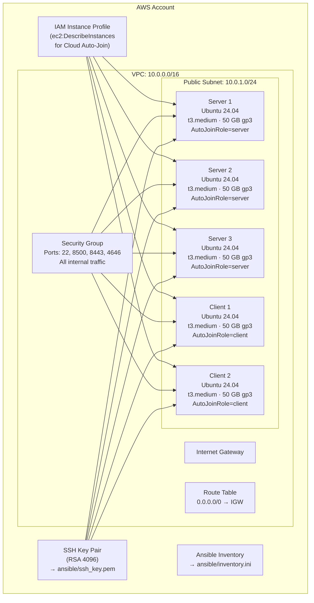

# Terraform AWS Infrastructure for Nomad + Consul

This directory contains Terraform configuration files to provision AWS infrastructure for a co-located HashiCorp Consul v2.0.1 and Nomad v2.0.4 cluster.

## What gets created



## Resources created

| Resource | Count | Details |
|----------|-------|---------|
| `aws_vpc` | 1 | `10.0.0.0/16`, DNS hostnames enabled |
| `aws_internet_gateway` | 1 | Attached to VPC |
| `aws_default_route_table` | 1 | Default route `0.0.0.0/0` → IGW |
| `aws_subnet` | 1 | `10.0.1.0/24`, auto-assign public IPs |
| `aws_security_group` | 1 | Refer to port table below |
| `aws_instance` (servers) | 3 | Ubuntu 24.04, t3.medium, 50 GB gp3, `AutoJoinRole=server` |
| `aws_instance` (clients) | 2 | Ubuntu 24.04, t3.medium, 50 GB gp3, `AutoJoinRole=client` |
| `aws_iam_role` | 1 | Trust policy for EC2 service |
| `aws_iam_role_policy` | 1 | `ec2:DescribeInstances`, `ec2:DescribeTags`, `autoscaling:DescribeAutoScalingGroups` |
| `aws_iam_instance_profile` | 1 | Attached to all instances |
| `tls_private_key` | 1 | RSA 4096 |
| `aws_key_pair` | 1 | Registered in AWS EC2 |
| `local_sensitive_file` | 1 | `ansible/ssh_key.pem` (mode 0600) |
| `local_file` (inventory) | 1 | `ansible/inventory.ini` |

## Security group rules

| Direction | Port | Protocol | Source/Dest | Purpose |
|-----------|------|----------|-------------|---------|
| Ingress | 22 | TCP | `allowed_ssh_cidr` | SSH access |
| Ingress | 8500 | TCP | `0.0.0.0/0` | Consul HTTP API & UI (used only when TLS is disabled; TLS-enabled Consul serves plain HTTP on loopback only) |
| Ingress | 8443 | TCP | `0.0.0.0/0` | Consul HTTPS API & UI |
| Ingress | 4646 | TCP | `0.0.0.0/0` | Nomad HTTP(S) API & UI |
| Ingress | all | all | Self (security group) | All internal cluster traffic |
| Egress | all | all | `0.0.0.0/0` | All outbound traffic |

TLS is enabled by default for both Consul and Nomad. Consul ports 8443 and Nomad port 4646 are open to the internet by default. Restrict these for production deployments. Refer to [../README-SECURITY-GROUP.md](../README-SECURITY-GROUP.md).

**Note:** Nomad ports 4647 (RPC) and 4648 (Serf) are covered by the `self` rule that allows all internal traffic within the security group.

## File reference

### main.tf

Configures the Terraform and AWS provider versions and sets default resource tags:

```hcl
Project     = var.project_name
Owner       = var.owner
Environment = var.environment
ManagedBy   = "Terraform"
```

### variables.tf

| Variable | Type | Default | Description |
|----------|------|---------|-------------|
| `aws_region` | string | `us-east-2` | AWS region |
| `project_name` | string | `nomad-consul` | Resource name prefix |
| `owner` | string | `devops-team` | Owner tag |
| `environment` | string | `dev` | Environment tag |
| `vpc_cidr` | string | `10.0.0.0/16` | VPC CIDR block |
| `subnet_cidr` | string | `10.0.1.0/24` | Public subnet CIDR |
| `allowed_ssh_cidr` | string | `0.0.0.0/0` | CIDR allowed for SSH |
| `ssh_user` | string | `ubuntu` | SSH username |
| `server_count` | number | `3` | Number of server instances |
| `client_count` | number | `2` | Number of client instances |
| `server_instance_type` | string | `t3.medium` | Server EC2 instance type |
| `client_instance_type` | string | `t3.medium` | Client EC2 instance type |
| `ami_owner` | string | `099720109477` | Canonical AWS account ID |
| `ami_name_filter` | string | `ubuntu/images/hvm-ssd-gp3/ubuntu-noble-24.04-amd64-server-*` | AMI name pattern |
| `ami_architecture` | string | `x86_64` | CPU architecture |

### outputs.tf

| Output | Description |
|--------|-------------|
| `ami_id` | Selected AMI ID |
| `vpc_id` | VPC ID |
| `subnet_id` | Public subnet ID |
| `security_group_id` | Security group ID |
| `server_public_ips` | List of server public IPs |
| `server_private_ips` | List of server private IPs |
| `client_public_ips` | List of client public IPs |
| `client_private_ips` | List of client private IPs |
| `consul_ui_urls` | Consul UI URLs (`https://<ip>:8443`) |
| `nomad_ui_urls` | Nomad UI URLs (`https://<ip>:4646`) |
| `ssh_commands` | Ready-to-use SSH commands |
| `ssh_private_key_path` | Path to generated SSH key |

### ami.tf

Queries AWS for the most recent Ubuntu 24.04 LTS (Noble) AMI owned by Canonical (`099720109477`), selecting `hvm`, `x86_64`, `available` images. Always uses the latest patched AMI.

### network.tf

Creates the VPC, internet gateway, route table, public subnet, and security group.

### compute.tf

Creates the server and client EC2 instances. Every instance receives:

- The generated SSH key pair
- The IAM instance profile (for Consul Cloud Auto-Join)
- Placement in the public subnet and security group
- A root EBS volume (50 GB, gp3)

The `AutoJoinRole` tag on each instance is what Consul uses for Cloud Auto-Join:

- Servers: `AutoJoinRole=server`
- Clients: `AutoJoinRole=client`

After instances are ready, `compute.tf` generates `ansible/inventory.ini` from the `inventory.tpl` template.

### iam.tf

Creates an IAM role and policy that allow instances to call `ec2:DescribeInstances`, `ec2:DescribeTags`, and `autoscaling:DescribeAutoScalingGroups`. This policy is the minimum needed for Consul Cloud Auto-Join. The IAM instance profile is attached to every EC2 instance.

### keypair.tf

Generates a 4096-bit RSA key pair with the Terraform TLS provider. The private key is written to `ansible/ssh_key.pem` (mode 0600) and the public key is registered in AWS EC2. The private key is marked sensitive and does not appear in `terraform output`.

### inventory.tpl

Jinja2 template that produces `ansible/inventory.ini`:

```ini
[servers]
nomad-consul-server-1 ansible_host=<public-ip> private_ip=<private-ip>
nomad-consul-server-2 ansible_host=<public-ip> private_ip=<private-ip>
nomad-consul-server-3 ansible_host=<public-ip> private_ip=<private-ip>

[clients]
nomad-consul-client-1 ansible_host=<public-ip> private_ip=<private-ip>
nomad-consul-client-2 ansible_host=<public-ip> private_ip=<private-ip>

[all:vars]
ansible_user=ubuntu
ansible_ssh_private_key_file=ssh_key.pem
ansible_python_interpreter=/usr/bin/python3
```

Do **not** hand-edit this file — it is regenerated on every `terraform apply`.

## Usage

### First deployment

```bash
cp terraform.tfvars.example terraform.tfvars
# Edit terraform.tfvars

terraform init
terraform plan
terraform apply
```

### View outputs

```bash
terraform output
terraform output nomad_ui_urls
terraform output ssh_commands
terraform output -raw server_public_ips
```

### Verify EC2 instances

```bash
aws ec2 describe-instances \
  --filters "Name=tag:Project,Values=nomad-consul" \
  --query 'Reservations[*].Instances[*].[InstanceId,State.Name,PublicIpAddress,Tags[?Key==`AutoJoinRole`].Value|[0]]' \
  --output table
```

### Scale the cluster

Edit `terraform.tfvars` and re-apply:

```hcl
client_count = 4
```

```bash
terraform apply
# Then re-run the Nomad and Consul client playbooks
cd ../../ansible
ansible-playbook -i inventory.ini consul_clients.yaml
ansible-playbook -i inventory.ini nomad_clients.yaml
```

### Destroy all resources

```bash
terraform destroy
```

## State management

State is stored **locally** in `terraform.tfstate`. Do not add a remote backend without team discussion. Never commit `terraform.tfstate` or `terraform.tfvars` to version control — both are git-ignored.
