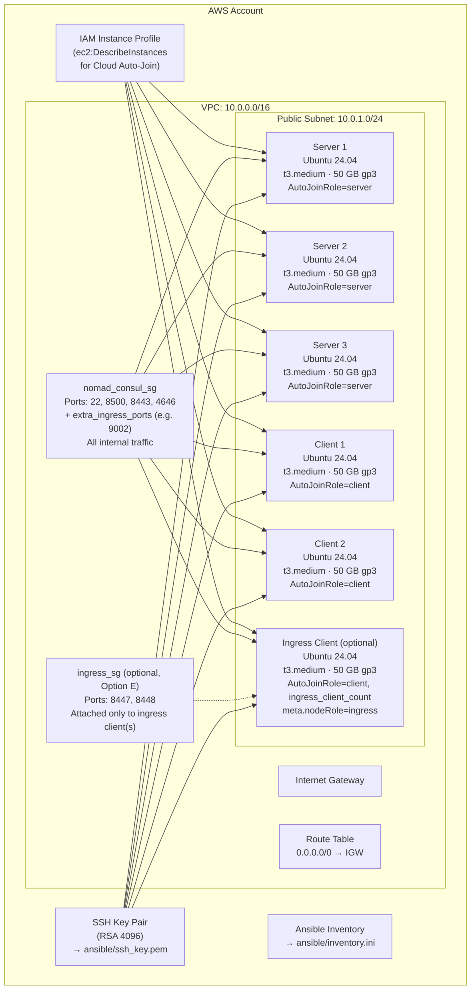

# Terraform AWS Infrastructure for Nomad + Consul

This directory contains Terraform configuration files to provision AWS infrastructure for a co-located HashiCorp Consul and Nomad cluster. Versions are pinned in [`ansible/group_vars/all.yaml`](../../ansible/group_vars/all.yaml), not here.

## What gets created



An optional external Application Load Balancer (`enable_load_balancer = true`, see [loadbalancer.tf](loadbalancer.tf)) can also be provisioned in front of the clients — omitted above since it's disabled by default.

## Resources created

| Resource | Count | Details |
|----------|-------|---------|
| `aws_vpc` | 1 | `10.0.0.0/16`, DNS hostnames enabled |
| `aws_internet_gateway` | 1 | Attached to VPC |
| `aws_default_route_table` | 1 | Default route `0.0.0.0/0` → IGW |
| `aws_subnet` | 1 (+1 if `enable_load_balancer`) | `10.0.1.0/24`, auto-assign public IPs; second AZ-only subnet for the optional ALB |
| `aws_security_group` | 1 (+1 if `ingress_client_count > 0`, +1 if `enable_load_balancer`) | `nomad_consul_sg` — refer to port table below. `ingress_sg` (Option E only) opens `8447`/`8448` on the dedicated ingress client(s) only. `alb_sg` (optional) |
| `aws_instance` (servers) | 3 | Ubuntu 24.04, t3.medium, 50 GB gp3, `AutoJoinRole=server` |
| `aws_instance` (clients) | 2 | Ubuntu 24.04, t3.medium, 50 GB gp3, `AutoJoinRole=client` |
| `aws_instance` (ingress\_clients) | 0–N (`ingress_client_count`) | Same as clients, plus `ingress_sg` — Option E only, see [`_context/wiki/dedicated-ingress-node-plan.md`](../../_context/wiki/dedicated-ingress-node-plan.md) |
| `aws_iam_role` | 1 | Trust policy for EC2 service |
| `aws_iam_role_policy` | 1 | `ec2:DescribeInstances`, `ec2:DescribeTags`, `autoscaling:DescribeAutoScalingGroups` |
| `aws_iam_instance_profile` | 1 | Attached to all instances (servers, clients, ingress clients) |
| `aws_lb` / `aws_lb_listener` / `aws_lb_target_group` (+attachments) | 0 or 1 each | Optional external ALB, only when `enable_load_balancer = true` — see [loadbalancer.tf](loadbalancer.tf) |
| `tls_private_key` | 1 | RSA 4096 |
| `aws_key_pair` | 1 | Registered in AWS EC2 |
| `local_sensitive_file` | 1 | `ansible/ssh_key.pem` (mode 0600) |
| `local_file` (inventory) | 1 | `ansible/inventory.ini` |

## Security group rules

### `nomad_consul_sg` (all servers and clients)

| Direction | Port | Protocol | Source/Dest | Purpose |
|-----------|------|----------|-------------|---------|
| Ingress | 22 | TCP | `allowed_ssh_cidr` | SSH access |
| Ingress | 8500 | TCP | `0.0.0.0/0` | Consul HTTP API & UI (used only when TLS is disabled; TLS-enabled Consul serves plain HTTP on loopback only) |
| Ingress | 8443 | TCP | `0.0.0.0/0` | Consul HTTPS API & UI |
| Ingress | 4646 | TCP | `0.0.0.0/0` | Nomad HTTP(S) API & UI |
| Ingress | per `extra_ingress_ports` | TCP | `0.0.0.0/0` | Application ports (default: `9002`, Countdash web UI) |
| Ingress | all | all | Self (security group) | All internal cluster traffic |
| Egress | all | all | `0.0.0.0/0` | All outbound traffic |

### `ingress_sg` (dedicated ingress client only, Option E — `ingress_client_count > 0`)

| Direction | Port | Protocol | Source/Dest | Purpose |
|-----------|------|----------|-------------|---------|
| Ingress | 8447 | TCP | `0.0.0.0/0` | Consul API Gateway — Countdash listener |
| Ingress | 8448 | TCP | `0.0.0.0/0` | Consul API Gateway — HashiCups listener |
| Egress | all | all | `0.0.0.0/0` | All outbound traffic |

Attached in addition to `nomad_consul_sg` — only the dedicated ingress
client has both. See
[`_context/wiki/dedicated-ingress-node-plan.md`](../../_context/wiki/dedicated-ingress-node-plan.md).

TLS is enabled by default for both Consul and Nomad. Consul ports 8443 and Nomad port 4646 are open to the internet by default. Restrict these for production deployments. Refer to [../README-SECURITY-GROUP.md](../README-SECURITY-GROUP.md).

**Note:** Nomad ports 4647 (RPC) and 4648 (Serf) are covered by the `self` rule that allows all internal traffic within the security group.

## File reference

### main.tf

Configures the Terraform and AWS provider versions and sets default resource tags:

```hcl
Project     = var.project_name
Owner       = var.owner
Environment = var.environment
ManagedBy   = "Terraform"
```

### variables.tf

| Variable | Type | Default | Description |
|----------|------|---------|-------------|
| `aws_region` | string | `us-east-2` | AWS region |
| `project_name` | string | `nomad-consul` | Resource name prefix |
| `owner` | string | `devops-team` | Owner tag |
| `environment` | string | `dev` | Environment tag |
| `vpc_cidr` | string | `10.0.0.0/16` | VPC CIDR block |
| `subnet_cidr` | string | `10.0.1.0/24` | Public subnet CIDR |
| `allowed_ssh_cidr` | string | `0.0.0.0/0` | CIDR allowed for SSH |
| `extra_ingress_ports` | list(object) | `[{port=9002, description="Countdash..."}]` | Additional TCP ports opened to `0.0.0.0/0` on `nomad_consul_sg` — one object per app port |
| `ssh_user` | string | `ubuntu` | SSH username |
| `server_count` | number | `3` | Number of server instances |
| `client_count` | number | `2` | Number of (internal) client instances |
| `ingress_client_count` | number | `0` | Number of dedicated public ingress client instances (Option E only — runs the Consul API Gateway; the only client whose security group opens app ports like `8447`/`8448`). See [`_context/wiki/dedicated-ingress-node-plan.md`](../../_context/wiki/dedicated-ingress-node-plan.md) |
| `server_instance_type` | string | `t3.medium` | Server EC2 instance type |
| `client_instance_type` | string | `t3.medium` | Client EC2 instance type (used for both internal and ingress clients) |
| `project_name` | string | `nomad-consul` | Resource name prefix |
| `ami_owner` | string | `099720109477` | Canonical AWS account ID |
| `ami_name_filter` | string | `ubuntu/images/hvm-ssd-gp3/ubuntu-noble-24.04-amd64-server-*` | AMI name pattern |
| `ami_architecture` | string | `x86_64` | CPU architecture |
| `enable_load_balancer` | bool | `false` | Create an optional external ALB in front of the clients, for the Load Balancer Integrations tutorial |
| `load_balancer_target_port` | number | `9002` | Port the ALB forwards to on every client (only used when `enable_load_balancer = true`) |
| `alb_subnet_cidr` | string | `10.0.2.0/24` | CIDR for the second, instance-free subnet the ALB requires (only created when `enable_load_balancer = true`) |

### outputs.tf

| Output | Description |
|--------|-------------|
| `ami_id` | Selected AMI ID |
| `vpc_id` | VPC ID |
| `subnet_id` | Public subnet ID |
| `security_group_id` | `nomad_consul_sg` ID (the shared security group — does not include `ingress_sg`) |
| `server_public_ips` / `server_private_ips` | List of server IPs |
| `client_public_ips` / `client_private_ips` | List of **internal (non-ingress)** client IPs only |
| `ingress_client_public_ips` | Public IPs of the dedicated ingress client(s) — runs the Consul API Gateway for Option E |
| `server_public_ips_by_node` | Server public IPs keyed by Nomad node name (`nomad-server-N`) |
| `client_public_ips_by_node` | Public IPs of **every** client (internal + ingress) keyed by node name — internal clients as `nomad-client-N`, the ingress client as `nomad-ingress-client-N` |
| `load_balancer_dns_name` / `load_balancer_url` | ALB DNS name/URL (`null` unless `enable_load_balancer = true`) |
| `consul_ui_urls` | Consul UI URLs (`https://<ip>:8443`) |
| `nomad_ui_urls` | Nomad UI URLs (`https://<ip>:4646`) |
| `ssh_commands` | Ready-to-use SSH commands, keyed `servers`/`clients`/`ingress_clients` |
| `ssh_private_key_path` / `ssh_public_key` | Path to / content of the generated SSH key |
| `iam_role_name` / `iam_instance_profile_name` | IAM role and instance profile names |

### ami.tf

Queries AWS for the most recent Ubuntu 24.04 LTS (Noble) AMI owned by Canonical (`099720109477`), selecting `hvm`, `x86_64`, `available` images. Always uses the latest patched AMI.

### network.tf

Creates the VPC, internet gateway, route table, public subnet, `nomad_consul_sg`
(the shared security group), and `ingress_sg` (attached only to the
dedicated ingress client, Option E). The optional ALB's second subnet and
`alb_sg` live in [loadbalancer.tf](loadbalancer.tf) instead.

### compute.tf

Creates the server, (internal) client, and ingress client EC2 instances.
Every instance receives:

- The generated SSH key pair
- The IAM instance profile (for Consul Cloud Auto-Join)
- Placement in the public subnet, `nomad_consul_sg`, and — ingress clients
  only — `ingress_sg`
- A root EBS volume (50 GB, gp3)

The `AutoJoinRole` tag on each instance is what Consul uses for Cloud Auto-Join:

- Servers: `AutoJoinRole=server`
- Clients and ingress clients: `AutoJoinRole=client`

After instances are ready, `compute.tf` generates `ansible/inventory.ini`
from the `inventory.tpl` template, merging clients and ingress clients into
one `[clients]` group with a `role` field each (see `inventory.tpl` below).

### iam.tf

Creates an IAM role and policy that allow instances to call `ec2:DescribeInstances`, `ec2:DescribeTags`, and `autoscaling:DescribeAutoScalingGroups`. This policy is the minimum needed for Consul Cloud Auto-Join. The IAM instance profile is attached to every EC2 instance (servers, clients, and ingress clients).

### loadbalancer.tf

Optional, gated by `enable_load_balancer` (default `false`). Creates an
external Application Load Balancer forwarding to `load_balancer_target_port`
on every (internal) client, plus its own subnet (`alb_subnet_cidr`) and
security group (`alb_sg`) — for the
[Load Balancer Integrations tutorial](https://developer.hashicorp.com/nomad/tutorials/load-balancing).

### keypair.tf

Generates a 4096-bit RSA key pair with the Terraform TLS provider. The private key is written to `ansible/ssh_key.pem` (mode 0600) and the public key is registered in AWS EC2. The private key is marked sensitive and does not appear in `terraform output`.

### inventory.tpl

Jinja2 template that produces `ansible/inventory.ini`:

```ini
[servers]
nomad-consul-server-1 ansible_host=<public-ip> private_ip=<private-ip>
nomad-consul-server-2 ansible_host=<public-ip> private_ip=<private-ip>
nomad-consul-server-3 ansible_host=<public-ip> private_ip=<private-ip>

[clients]
nomad-consul-client-1 ansible_host=<public-ip> private_ip=<private-ip> nomad_node_role=internal
nomad-consul-client-2 ansible_host=<public-ip> private_ip=<private-ip> nomad_node_role=internal
nomad-consul-ingress-client-1 ansible_host=<public-ip> private_ip=<private-ip> nomad_node_role=ingress

[all:vars]
ansible_user=ubuntu
ansible_ssh_private_key_file=ssh_key.pem
ansible_python_interpreter=/usr/bin/python3
```

The ingress client entry only appears when `ingress_client_count > 0`
(Option E). `nomad_node_role` is read by `ansible/roles/nomad`'s
`nomad_client_meta` default and rendered into Nomad's client
`meta.nodeRole` — see
[`_context/wiki/dedicated-ingress-node-plan.md`](../../_context/wiki/dedicated-ingress-node-plan.md).

Do **not** hand-edit this file — it is regenerated on every `terraform apply`.

## Usage

### First deployment

```bash
cp terraform.tfvars.example terraform.tfvars
# Edit terraform.tfvars

terraform init
terraform plan
terraform apply
```

### View outputs

```bash
terraform output
terraform output nomad_ui_urls
terraform output ssh_commands
terraform output -raw server_public_ips
```

### Verify EC2 instances

```bash
aws ec2 describe-instances \
  --filters "Name=tag:Project,Values=nomad-consul" \
  --query 'Reservations[*].Instances[*].[InstanceId,State.Name,PublicIpAddress,Tags[?Key==`AutoJoinRole`].Value|[0]]' \
  --output table
```

### Scale the cluster

Edit `terraform.tfvars` and re-apply:

```hcl
client_count = 4
```

```bash
terraform apply
# Then re-run the Nomad and Consul client playbooks
cd ../../ansible
ansible-playbook -i inventory.ini consul_clients.yaml
ansible-playbook -i inventory.ini nomad_clients.yaml
```

### Destroy all resources

```bash
terraform destroy
```

## State management

State is stored **locally** in `terraform.tfstate`. Do not add a remote backend without team discussion. Never commit `terraform.tfstate` or `terraform.tfvars` to version control — both are git-ignored.
